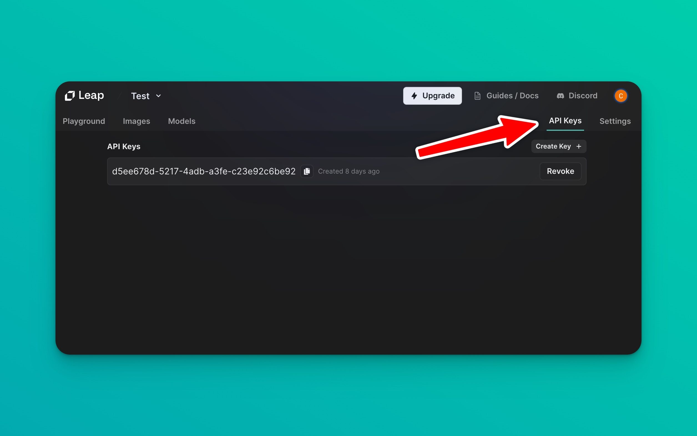

# Authentication

In order to use our API you need to get your `leap-api-key` first. Create an account, log in, within a project, on the upper right corner click on `API Keys`.



From here, you can copy the `leap-api-key` and use it in your requests.

## Authorizing in RESTful API

Calling the API requires an API Key. You can pass the API Key as a Bearer token in the `Authorization` header:

```bash copy
import requests

url = "https://api.tryleap.ai/api/v1/images/models/modelId/inferences"

payload = {
    "prompt": "A photo of an astronaut riding a horse",
    ... other parameters
}
headers = {
    "accept": "application/json",
    "content-type": "application/json",
    "authorization": "Bearer YOUR_API_KEY_HERE"
}

response = requests.post(url, json=payload, headers=headers)

print(response.text)
```


## Authorizing in TypeScript SDK;

When initializing the SDK you can pass the API Key as a parameter:

```ts copy
import { Leap } from "@leap-ai/sdk";

const leap = new Leap(process.env.LEAP_API_KEY);
```

## Revoking an API Key

You can revoke an API Key at any time by clicking on the `Revoke` button next to the API Key you want to revoke.

This will immediately revoke the API Key and any requests using that API Key will fail.


## Need Assistance?

For queries or further assistance, kindly reach out via email at [help@tryleap.ai](mailto:help@tryleap.ai) or visit our [Support Page](https://www.leap.com/support).

Thank you for choosing Leap!
