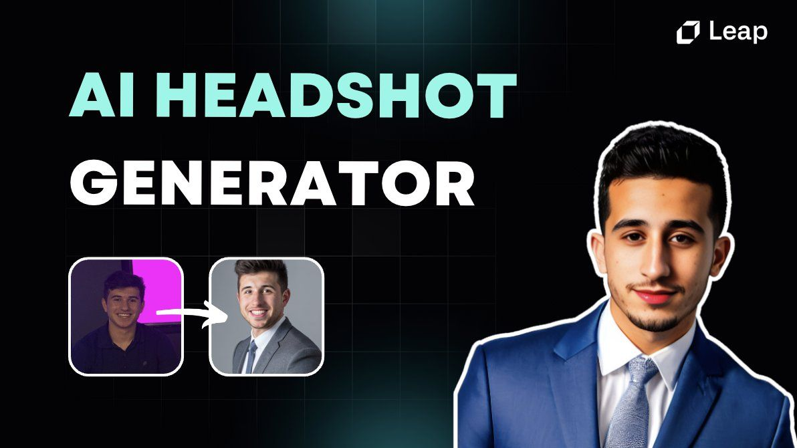
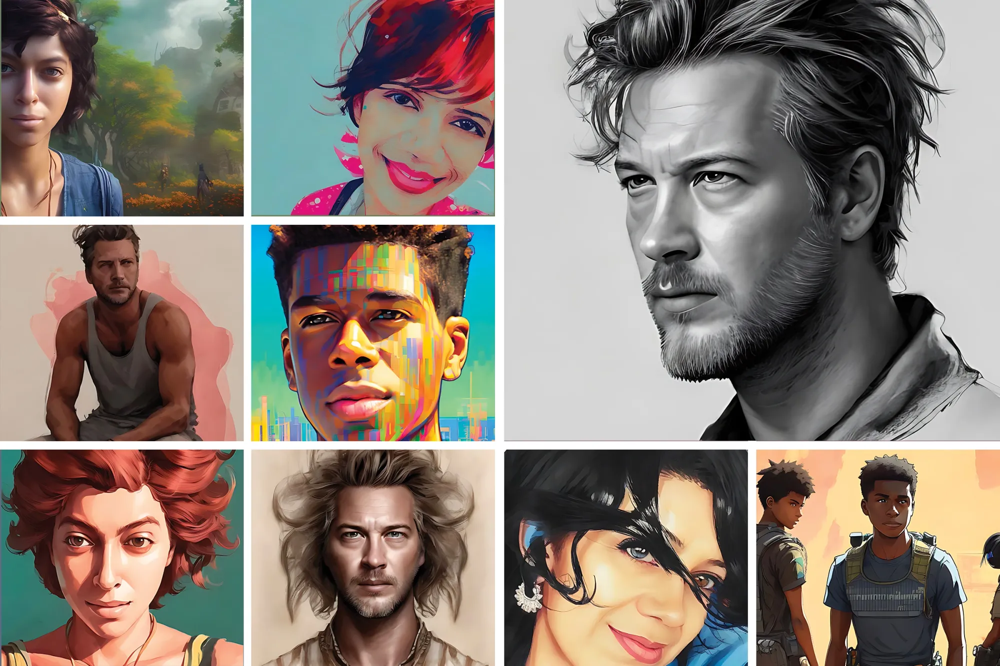
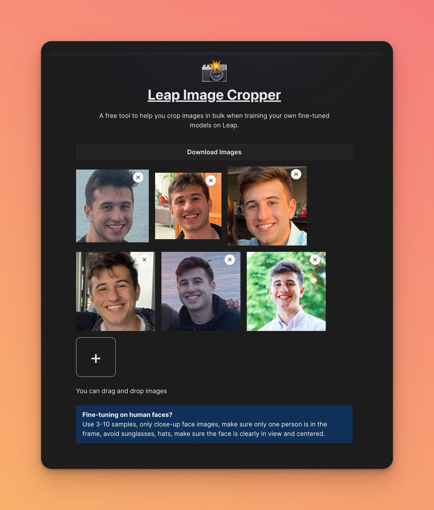
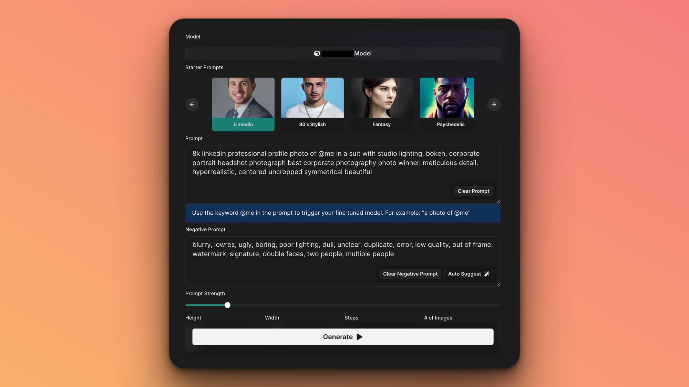
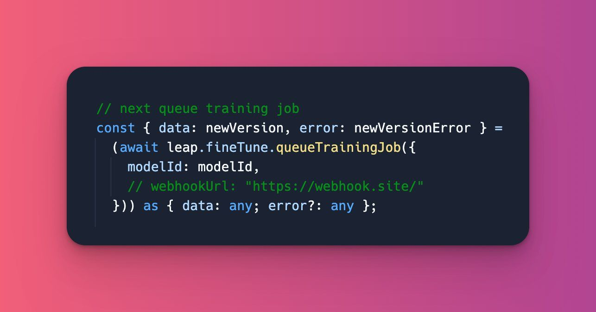

# Create an AI Headshot Generator: Fine-tune Stable Diffusion with Leap API ⚡️

**You've probably seen AI magic avatars.**

They flooded social networks in November 2022, and ever since we've seen the demand for AI avatar generators skyrocket.

The way this technology works is by using _Dreambooth_ to fine-tune a Stable Diffusion model.

While magic avatars for social media a slew of new apps are using fine-tuning for a much wider variety of use cases ranging from Linkedin photos to stylized icons.

In this post, we'll focus on how to make your own AI headshot generator using fine-tuning with the Leap API.

Let's get into it!

## Gather your image samples 📸

First, you'll need image samples to teach the model what your face looks like.

These are critical. Garbage in = garbage out. Here's what we recommend:

→ Use 3-15 high quality image samples

→ Use only close-up face images

→ 1 person in the frame

→ Avoid sunglasses, hats, etc.

→ Make sure the face is clearly in view (to detect if the face is in view, you can use this api: [https://cloudinary.com/documentation/face\_detection\_based\_transformations](https://cloudinary.com/documentation/face_detection_based_transformations?ref=leap.mymidnight.blog))

## Pre-process Images ✨

Once you have 3-15 samples, we can start pre-processing the images.

_Step 1:_

For headshots or avatars, center and crop your face photos.

We couldn't find a free bulk image cropper. So we built one for you.

Try it out: [https://www.tryleap.ai/crop](https://www.tryleap.ai/crop?ref=leap.mymidnight.blog)

_Step 2:_

After cropping the images properly, we recommend resizing each image to 512x512 using a website like [https://www.birme.net/](https://www.birme.net/?ref=leap.mymidnight.blog)

_Step 3 (optional):_

You can continue refining your pre-processing pipeline with techniques like image upscaling and duplicating the best samples.

## Train your model 🪄

_From Leap Dashboard:_

Once you have your samples pre-processed, you can start training your model on [tryleap.ai](https://www.tryleap.ai/?ref=leap.mymidnight.blog).

Create a new model and upload your samples

<figure class="kg-card kg-video-card">
<video src="https://cdn.getmidnight.com/0915da4d5aad32cf7f0377582a72cc6e/media/2023/06/Upload-Sampels.mp4" poster="https://img.spacergif.org/v1/3024x1728/0a/spacer.png" width="3024" height="1728" playsinline="" preload="metadata" style="background: transparent url('https://cdn.getmidnight.com/0915da4d5aad32cf7f0377582a72cc6e/2023/06/media-thumbnail-ember202.jpg') 50% 50% / cover no-repeat;"></video>
</figure>

Click train and wait for it to finish processing.

Once it's finished you're ready to start generating your headshots or avatars.

_From Leap API_

To generate from the API, check out the code from the google colab below:

[Google Colaboratory](https://colab.research.google.com/drive/1v45UprB-fzSeWk4wTnYJEx4dEeW2DnYw?usp=sharing&ref=leap.mymidnight.blog)

## Generate your images 🌉

Once your model is finished, click "try in playground".

You can then enter a prompt or use one of our starter prompts to generate your avatar style:

_Additional Prompting Tips:_

→ see our collection of great starter prompts here ([https://guides.tryleap.ai/guides/stellar-prompts-for-ai-avatars](https://guides.tryleap.ai/guides/stellar-prompts-for-ai-avatars?ref=leap.mymidnight.blog))

→ try  'Prompt Examples' in the dashboard

→ try using the auto-suggested Negative prompt in our dashboard

## Final results 👀

This is an example model trained on Kayne West.

You can generate Psychadelic, Fantasy, Professional, Jedi style, and more!

## Get started with Leap Fine-tuning API ⚡️

To see how all of this works using code we have a few resources:

- [1-click Repl to generate headshots](https://replit.com/@leap-ai/AI-Avatars-App-Javascript-Harry-Potter-Professional?v=1&ref=leap.mymidnight.blog)
- [Next.js starter project](https://github.com/alexschachne/leap-ai-avatars?ref=leap.mymidnight.blog) that gives you a template to build all of this into an app on top of the Leap API
- [Google Colab](https://colab.research.google.com/drive/1v45UprB-fzSeWk4wTnYJEx4dEeW2DnYw?usp=sharing&ref=leap.mymidnight.blog) to run this process with Python

[Leap AI Avatars](https://ai-avatars.vercel.app/?ref=leap.mymidnight.blog)

## 🚀 Wrapping Up

That's all for this blog!

Try it out for yourself and let us know if you have any questions.

For additional support please join our [discord](https://discord.com/invite/NCAKTUayPK?ref=leap.mymidnight.blog).