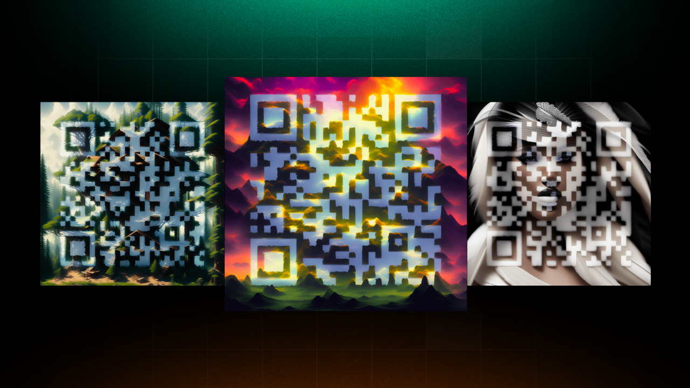

# Create Stunning QR Codes with AI: ControlNet & Leap API

AI-generated QR codes are the next big thing.

And we just launched a way for any business to create them at scale.

All you need is a URL and a prompt.

Supported from both our dashboard and API.

Let's dive in:

## Try it out on our dashboard:

1. Go to tryleap.ai
2. Pick your mode → qr\_code
3. Set URL
4. Set prompt

That's it.

Then watch the magic happen 🪄

<figure class="kg-card kg-video-card">
<video src="https://cdn.getmidnight.com/0915da4d5aad32cf7f0377582a72cc6e/media/2023/06/Tutorial-QR.mp4" poster="https://img.spacergif.org/v1/3024x1728/0a/spacer.png" width="3024" height="1728" loop="" autoplay="" muted="" playsinline="" preload="metadata" style="background: transparent url('https://cdn.getmidnight.com/0915da4d5aad32cf7f0377582a72cc6e/2023/06/media-thumbnail-ember472.jpg') 50% 50% / cover no-repeat;"></video>
</figure>

## Try it out with our API:

1. Go to tryleap.ai and get your API key
2. Open the Google Colab below.

[Google Colaboratory](https://colab.research.google.com/drive/1Vpcqg3sa_aHeW7bo7aZzfNhslISvACkw?usp=sharing&ref=leap.mymidnight.blog)

All you need is to link an existing QR code image, add a prompt, and our Remix API will do the rest.

## Additional tips for better results:

1. Change the model to Realistic Vision
2. Get amazing prompts → [https://www.wallpapers.fyi](https://www.wallpapers.fyi)
3. Experiment with Prompt Strength (we like 8 for more detailed images)
4. Try stronger Control Strength for stronger outlines (1.5 is default)

## 🚀 Wrapping Up

That's all for this blog!

Try it out for yourself and let us know if you have any questions.

For additional support please join our [discord](https://discord.com/invite/NCAKTUayPK?ref=leap.mymidnight.blog).