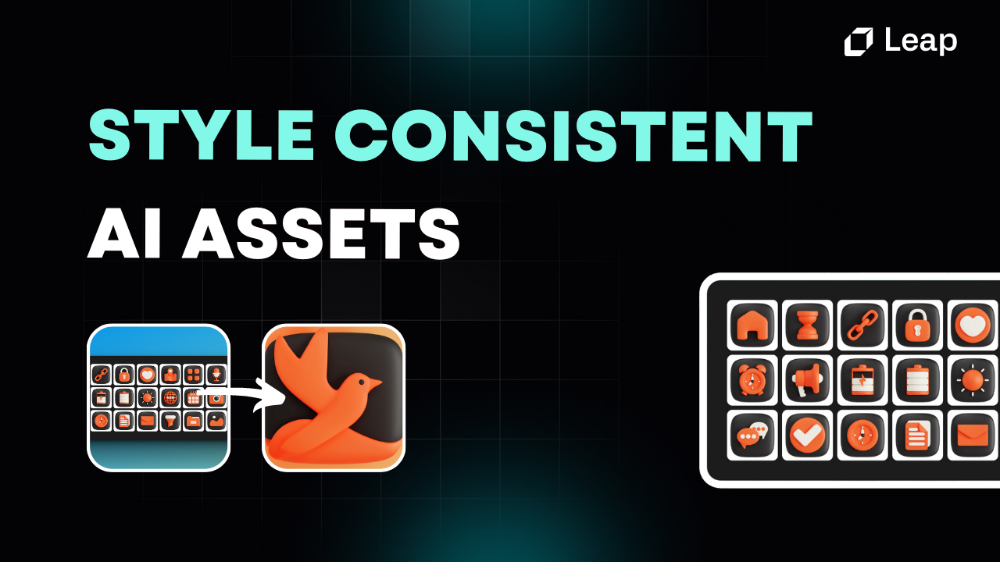
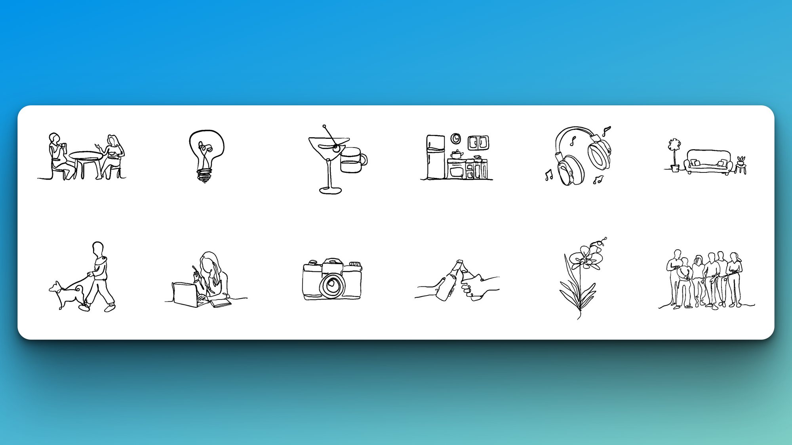
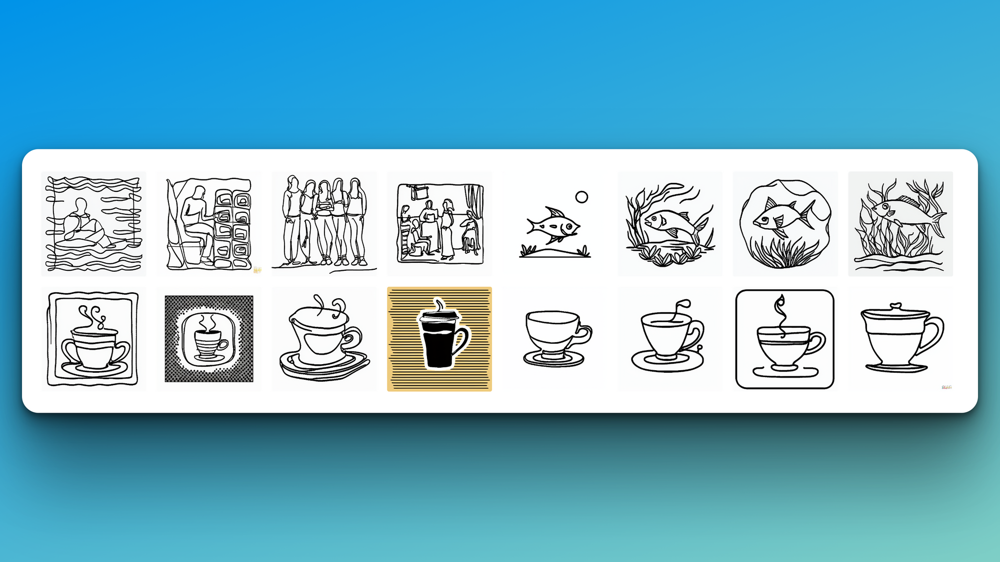
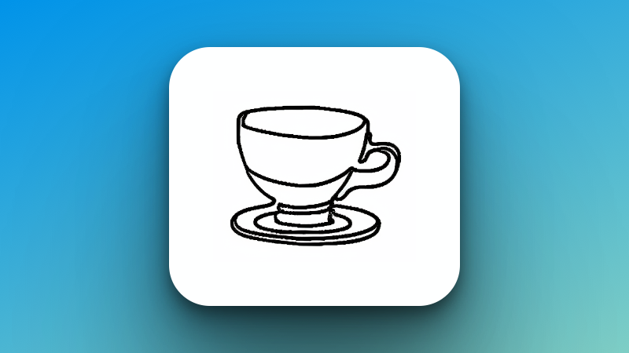
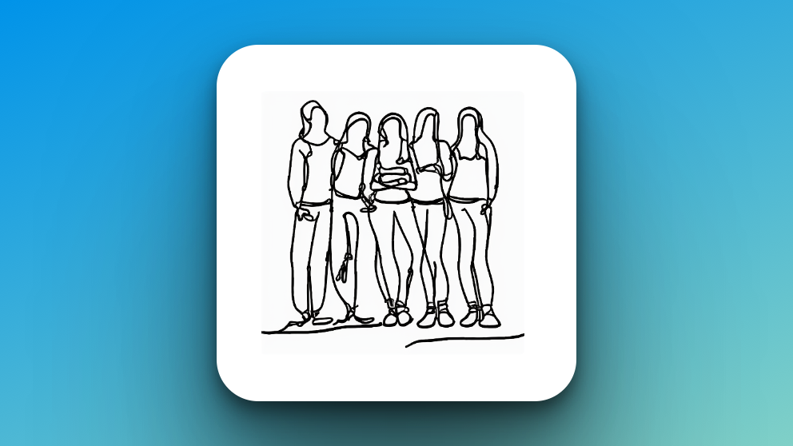
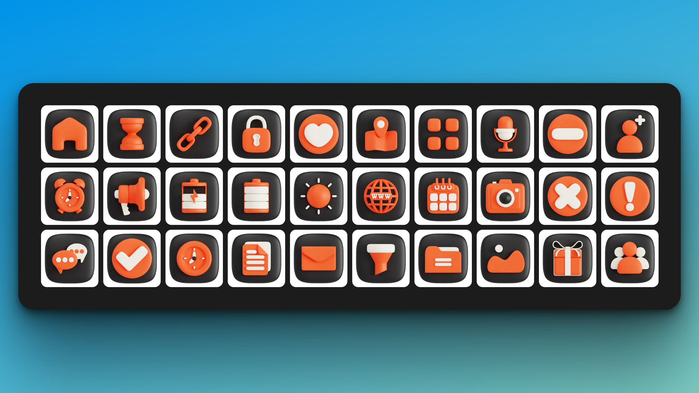
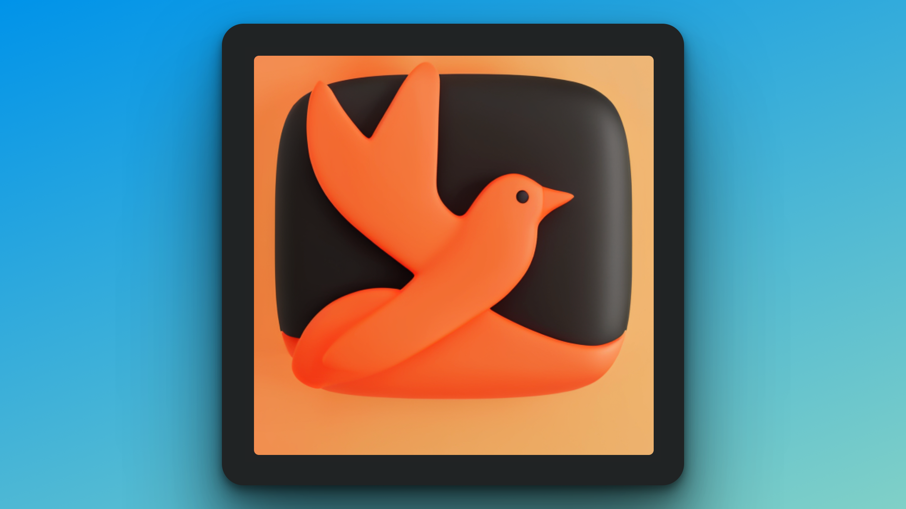
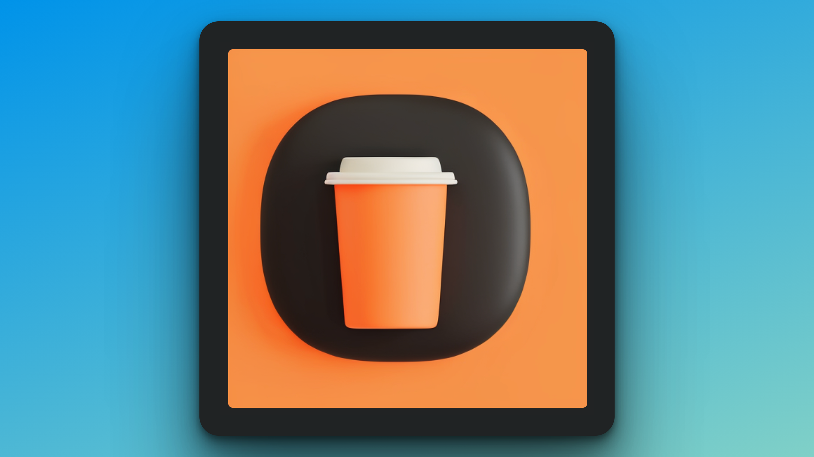

# How To Generate Style-Consistent Assets on Leap

Style-consistent asset generation using AI is revolutionizing capabilities for design, marketing, and product teams.

Using custom image model training on [Leap](https://tryleap.ai/?ref=leap.mymidnight.blog), teams can now create an endless library of visual assets with just a handful of reference images reflecting your their design style.

Let's take a look at a few examples to see how it works.

### Line Art Style ➰

Meet Mylene. She created a website [https://fromastranger.com](https://fromastranger.com/?ref=leap.mymidnight.blog) that lets strangers write letters to each other.

She created a few line-art design style illustrations for each letter, and then came to Leap to automate the creation process.

To do so, she went to Leap and trained a custom line-art model in just a few minutes.

After successfully custom line-art model training, she could generate an endless array of style-consistent assets.

💡 To get started training a model, check out [this Youtube tutorial](https://www.youtube.com/watch?v=5SJhto54jZo&ref=leap.mymidnight.blog)

First, she uploaded this dataset of drawings to teach the model her current style:

Specifically, her dataset had:

- Between 10-30 style-consistent sample images
- All images had the same size / dimensions / level of zoom
- Enough variety that the model can learn different variations on the style

20 minutes later, the model finished training and she was able to generate images like these that she could use as illustrations, simply from a text prompt:

Here's the specific prompt she used:

**Prompt:** `design a line art icon of coffee cup @subject style`

In this prompt, we described the type of image we wanted, and added @`subject` which tells the AI model to apply the style you trained it on.

**Output:**

Here's another example:

**Prompt:** `design a continuous line art image that captures the transformative power of vulnerability and seeking help @subject style`

**Output**:

It's that simple!

You now know how to train your team's style and generate unlimited visual assets based on only a few reference images.

### Icons 👾

In addition to training artistic styles, you can also use style transfer for assets like icons or logos.

Let's take a look at an example icon dataset:

The dataset has:

- 30 style-consistent sample images
- All images had the same size / dimensions / level of zoom
- Enough variety that the model can learn different variations on the style

After 20 minutes training the model, you'll be able to generate an unlimited number of new icons in the same style.

Here are the outputs:

**Prompt:** `a bird @subject style, black background, orange forefront`

**Output:**

**Prompt:** `a @subject style icon of a coffee cup, black background, orange forefront`

**Output:**

### Prompt Consulting Support

While some custom models can work perfectly out-of-the-box, selecting the proper dataset for your model and prompting correctly can take some practice.

For businesses, we offer dedicated support and prompt consulting to work hand-in-hand with your team to achieve the results you're looking for.

Reach out at help@tryleap.ai to inquire.

### Wrapping Up 🚀

That's all for this blog!

Try it out for yourself and let us know if you have any questions.

For additional support please join our [discord](https://discord.com/invite/NCAKTUayPK?ref=leap.mymidnight.blog).
