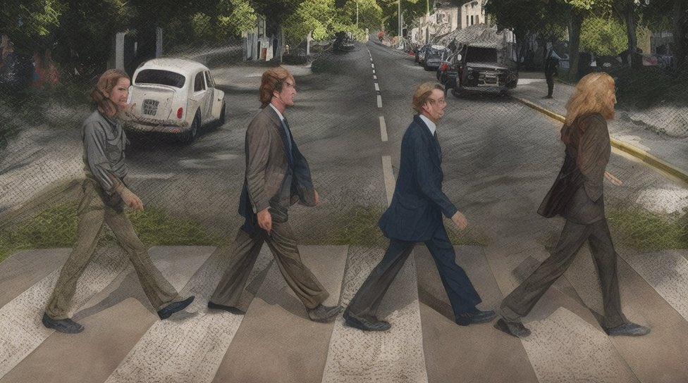
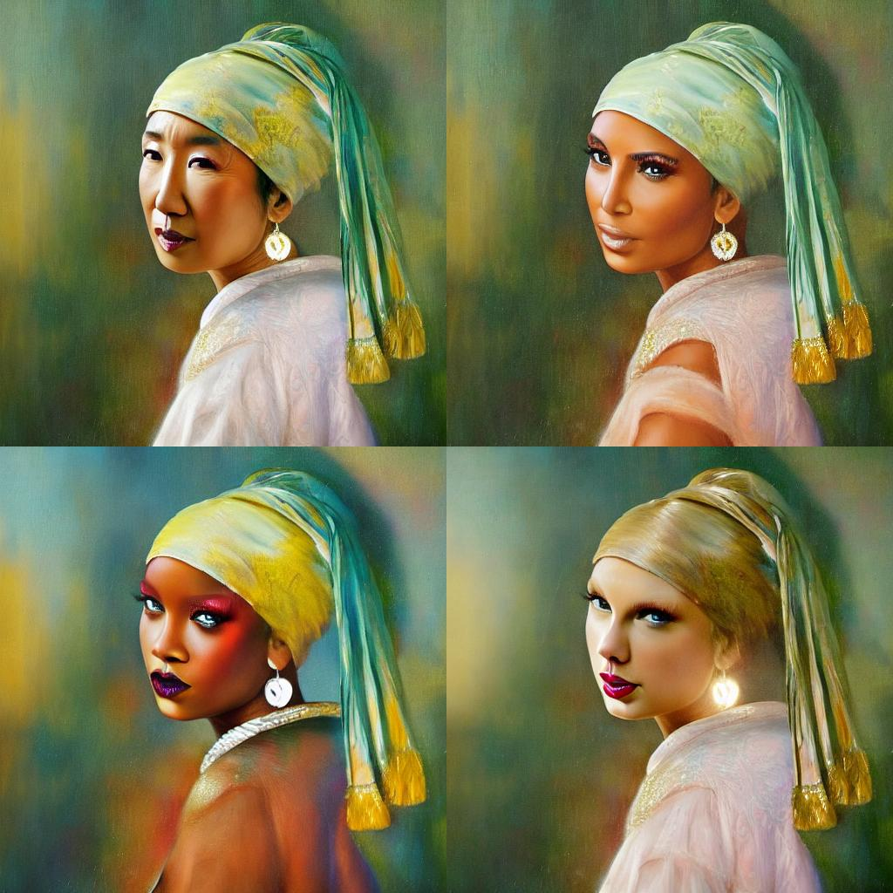
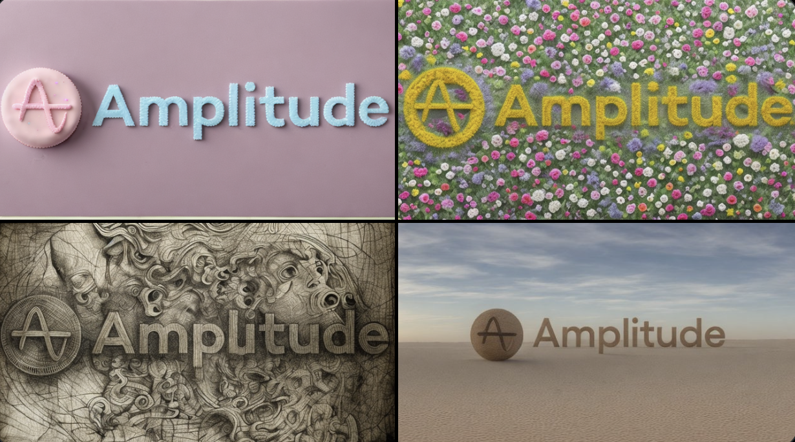
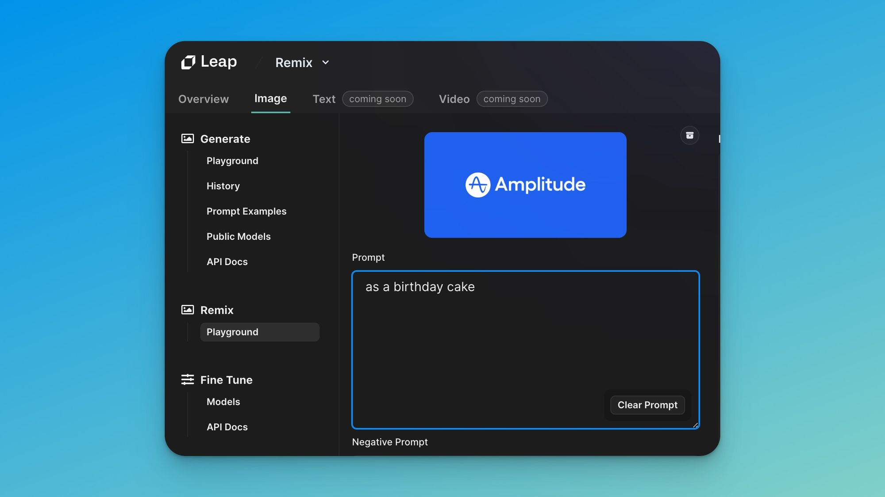
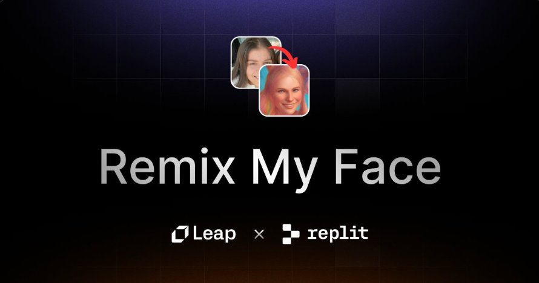
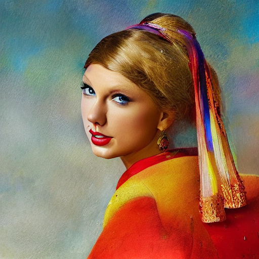
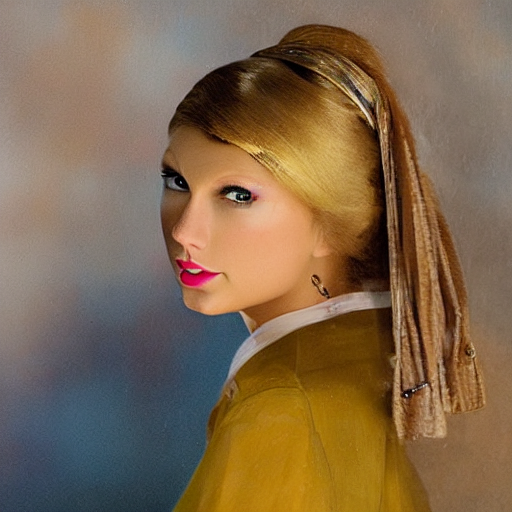
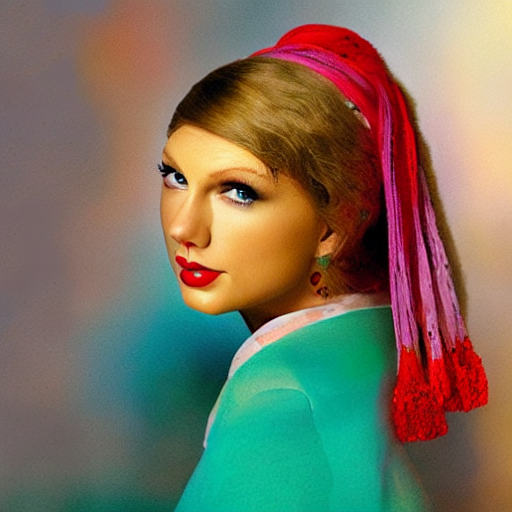

# Remix Photos using AI: Art, Logos, Selfies, QR Codes, & more 📸



At [Leap](https://www.tryleap.ai/?ref=leap.mymidnight.blog), we recently rolled out the Remix API – a ControlNet powered endpoint that allows you to tell the AI model which parts of an image to keep and which to change.

This means you can start the image generation process with an existing image that will serve as a template for the model.

Here's a quick example:




Starting with the input image on the left, ControlNet performs "canny" edge detection as a "conditioning" step for generating the stunning images on the right.

On the far left we have the existing image.

The model follows it as a template to generate the subsequent photos while maintaining the original structure.

On the far right we have the result given our prompts: `best quality, extremely detailed Sandra Oh, Kim Kardashian, Rihanna, Taylor Swift`

It's pretty amazing – ControlNet opens infinite possibilities for remixing photos!

Compared to the performance of other similar technologies like `img2img` and `pix2pix`, ControlNet really shines in its ability to keep the overall structure of an image consistent.

## Remix is cool. But what can it actually do?

We've had many of our users ask us what the best Remix API use cases are.

Here's a go-to list of the top 4 Remix Use Cases we've seen so far at [Leap](https://www.tryleap.ai/?ref=leap.mymidnight.blog)

**1\. Remix Your Art 🎨**

With Remix _pose_ mode,  you can a draw simple sketch, and then generate a stunning image from it with AI!

We launched a simple app where you try this out live: [http://drawit.art](https://t.co/UhzxkMfiS3?ref=leap.mymidnight.blog).

Here's a quick demo:


We also made the code public & wrote a guide so you can follow step by step, and build your own clone in under 5 minutes.

Find the open source Github repo here: [https://github.com/leap-api/draw-it](https://github.com/leap-api/draw-it?ref=leap.mymidnight.blog)

Read the step-by-step guide here: [https://www.tryleap.ai/docs/how-to-build-a-sketch-to-image-app-with-leap-remix](https://www.tryleap.ai/docs/how-to-build-a-sketch-to-image-app-with-leap-remix?ref=leap.mymidnight.blog)

For kids and adults alike, Remix can give you artistic superpowers!

**2\. Remix Logos ✍️**

We recently partnered with [Amplitude](https://twitter.com/Amplitude_HQ?ref=leap.mymidnight.blog) for an AI Hackathon, and thought: "what a better way to showcase what's possible than to remix their logo with Leap?"

So, here's a taste at the kind of results you can get with our Remix API on logos:



A remix of Amplitude's logo

All you need to get these kind of results is an Image + a prompt;

In this case, we used Amplitude's logo as the image, PLUS a prompt like:

- "as a birthday cake"
- "as a flower garden"
- "as a desert"
- "as a davinci drawing"



Remix in the Leap Dashboard or with our API

You can it out for yourself in our [dashboard](https://www.tryleap.ai/?ref=leap.mymidnight.blog)!

Or check out our [developer docs](https://www.tryleap.ai/developers?ref=leap.mymidnight.blog), to learn how remix images within your own app.

**3\. Remix Your Selfies 🤳**

Remix isn't just great for AI art and logos – it can also create magical AI avatars in seconds!

To show you how, we build ['Remix My Face'](http://remixmyface.com/?ref=leap.mymidnight.blog), an open source app that lets you upload a selfie, and get a custom avatar in seconds.


Try it out for yourself here! [http://remixmyface.com](https://t.co/xgSjm0i6GH?ref=leap.mymidnight.blog)

Of course, all of the code is open source :). Fork it, and make it your own!

Github repo: [https://github.com/leap-api/remix-my-face](https://github.com/leap-api/remix-my-face?ref=leap.mymidnight.blog)

Step-by-step guide: [https://www.tryleap.ai/docs/build-remix-my-face](https://www.tryleap.ai/docs/build-remix-my-face?ref=leap.mymidnight.blog)

Side-note: all of our open source builds are also on [Replit](https://replit.com/@leap-ai?ref=leap.mymidnight.blog)!  

Run them with 1-click in the browser. No development setup required.



Try the RemixMyFace Repl!

**4\. Remix QR Codes 👾**

Just 2 days ago [this Reddit post](https://www.reddit.com/r/StableDiffusion/comments/141hg9x/controlnet_for_qr_code/?ref=leap.mymidnight.blog) dropped showing how QR codes can now be created using Stable Diffusion and ControlNet!


Turn QRs into stunning images while still having them work reliably with Stable Diffusion and ControlNet.

These will be in products everywhere in the next 6 months.

Check out the Remix documentation here to see how to get started.

**Bonus: Remix yourself into Spiderman 🕷**

As a bonus use-case, we wanted to highlight a Leap user who decided to get creative with Remix!

Introducing WebHead by [Patrick](https://twitter.com/_patrickpc?ref=leap.mymidnight.blog):


When asked what the inspiration was, he said, "Spider-Man: Across The Spider-Verse was sooo good, it inspired me to make this".

Along we Patrick, we wanted to shoutout our entire community of builders who have shipped hundreds of apps on us!

To see more demos, connect with our community, or get support join our [discord](https://discord.com/invite/NCAKTUayPK?ref=leap.mymidnight.blog).

## How to Get Started with Remix API ⚡️

These use-cases are just the tip of the iceberg!

Remix is such a new technology that we are discovering innovative ways our users integrate it everyday.

Let's talk about how you can try it.

Here's a quick example on how to generate Taylor Swift from our original image above using the [Leap API](https://www.tryleap.ai/?ref=leap.mymidnight.blog).

1. Open your terminal and paste in this code.
2. Be sure to replace `YOUR_API_KEY` with your API key

```bash
curl -X 'POST' \
  'https://api.tryleap.ai/api/v1/images/edit/url' \
  -H 'accept: application/json' \
  -H 'Authorization: Bearer YOUR_API_KEY' \
  -H 'Content-Type: application/json' \
  -d '{
  "imageUrl": "https://static.tryleap.ai/edits-dce8d749-4ccf-4017-a1ac-1dd81746dfee/dce8d749-4ccf-4017-a1ac-1dd81746dfee",
  "prompt": "taylor swift, best quality, extremely detailed",
  "steps": 25,
  "seed": 3,
  "negativePrompt": "monochrome, lowres, bad anatomy, worst quality, low quality",
  "numberOfImages": 4
}'
```

What you'll get:







Images aren't always perfect, but with enough attempts you can get great results like the one on the bottom right corner. Generated using **Stable Diffusion v1.5**

## 🚀 Wrapping Up

That's all for this blog!

Try it out for yourself and let us know if you have any questions.

For additional support please join our [discord](https://discord.com/invite/NCAKTUayPK?ref=leap.mymidnight.blog).