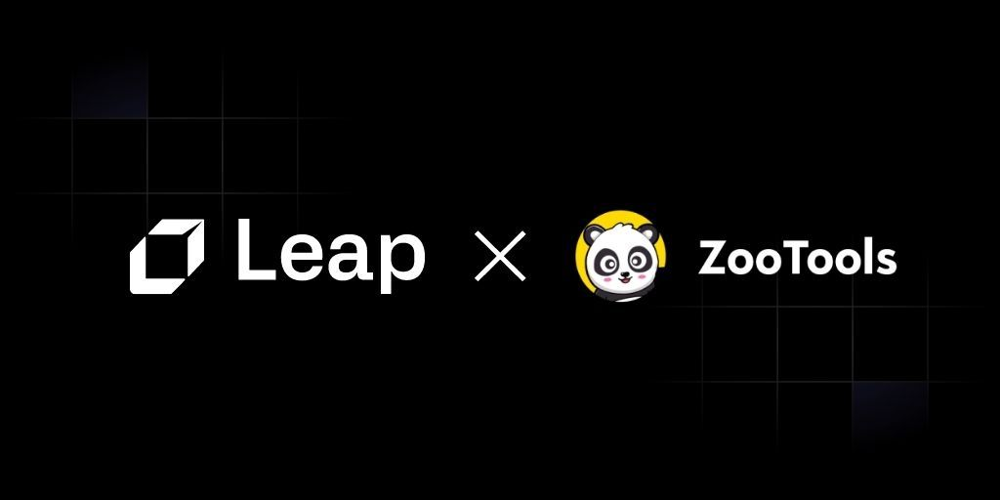
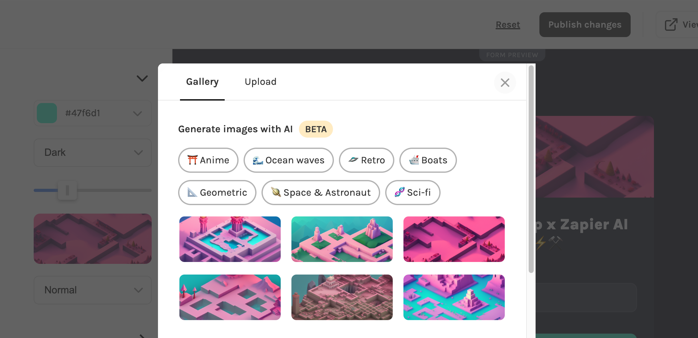
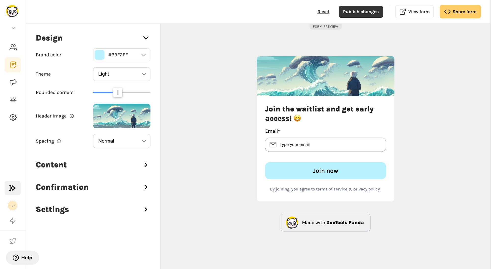

# Leap x ZooTools

Transforming Form Creation with Leap's AI-Powered Visuals on ZooTools

## Introduction

[ZooTools](https://www.zootools.co/?ref=leap.mymidnight.blog), an all-in-one platform for creating viral waitlists, newsletters, and social referrals, is taking user experience up a notch by integrating Leap's AI-powered image generation API.

This collaboration allows businesses, including blogs, website builders, and form builders, to dynamically generate custom header images for their forms.

Leap's AI-generated visuals offer a captivating alternative to stock image platforms like Unsplash, making your form's visual assets stand out.

## Embracing Innovation: ZooTools Partners with Leap

With the aim of improving user experience and transcending stock image limitations, ZooTools integrated Leap's advanced image generation API.

This partnership enables ZooTools users to effortlessly create personalized header images that align with their specific needs, all within a seamless, user-friendly environment.

## Streamlined User Experience with Captivating Visuals

ZooTools' intuitive platform delivers a casual and enjoyable user experience, making it easy to create highly customized and engaging forms.

The seamless integration of Leap's image generation API enhances the platform with unparalleled personalization and creativity.

Users can effortlessly navigate the platform, design visually striking custom assets, and craft forms that genuinely reflect their brand identity.

## Leap's Impact on ZooTools: Streamlined, Personalized Form Creation

Leap's image generation API has greatly enriched ZooTools' offerings by allowing users to create unique, tailor-made images that accurately represent their brand's essence.

This enhancement has solidified ZooTools as the preferred choice for businesses seeking visually appealing and engaging forms that resonate with their target audience.

[Jorge Ferreiro](https://twitter.com/JGFerreiro?ref=leap.mymidnight.blog), Founder of ZooTools, shared his thoughts on the collaboration:

> "Integrating Leap's AI-generated images has truly revolutionized our platform. Our users now have the ability to create highly engaging forms with personalized visuals, setting them apart from the competition and leaving a lasting impression on their audience."

## Conclusion

The collaboration between Leap and ZooTools illustrates the power of AI in elevating user experiences across industries. With Leap's AI-powered image generation API, ZooTools delivers an immersive, personalized, and efficient form creation process.

As the demand for innovative solutions and engaging user experiences continues to rise, Leap and ZooTools are at the forefront of redefining form creation with captivating, AI-generated visuals.