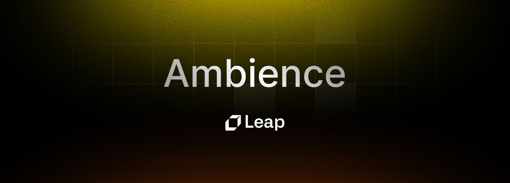
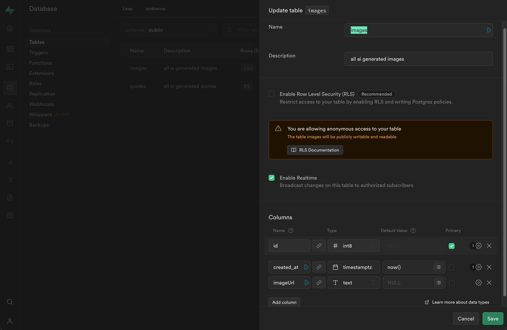
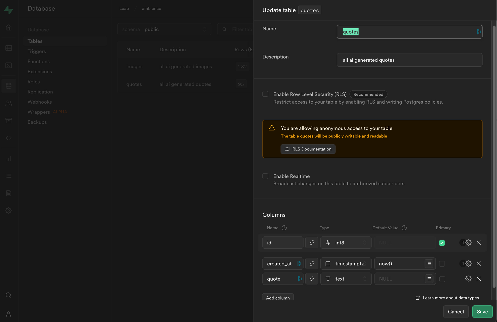

# Build 'Ambience': AI-Generated Wallpaper Chrome Extension



This guide will walk you through how to build "Ambience", a Chrome Extension powered by Leap - similar to the top extension 'Momentum' which takes over your "New Tab" screen and replaces it with stunning wallpapers and inspirational quotes.

But we'll make our build even better - by making the Wallpapers & Quotes AI-generated instead of static.

Every hour a new Wallpaper will be generated by Leap, and a new Quote will be generated by GPT-4.


Here are the links to the repo and demo:

- Github Repo: [https://github.com/leap-api/draw-it](https://github.com/leap-api/ambience?ref=leap.mymidnight.blog)
- Live Chrome Extension: [https://chrome.google.com/webstore/detail/ambience-ai/ndgjbbjefciomenkpggaepmhbkhmapap](https://chrome.google.com/webstore/detail/ambience-ai/ndgjbbjefciomenkpggaepmhbkhmapap?ref=leap.mymidnight.blog)

## Getting Started

This build consists of two main apps, which are both part of the same repo:

- **Chrome Extension:** The first app is a client-only react application that renders a front-end and calls an external api endpoint to get images/quotes.
- **APIs:** The second app consists of a Next.js app with multiple serverless API endpoints that handle everything from generating images, quotes, and also serving them to the chrome extension. This also handles the logic for generating new assets every hour.

For the purpose of this guide, we will simply walk you through all the parts of the existing repo and explain what everything is doing.

Let's get started:

### Clone the repository:

```bash
git clone https://github.com/leap-api/ambience.git
```

### Run the Chrome extension:

Enter the `chrome-extension` directory:

```bash
cd chrome-extension
```

Install dependencies:

```bash
yarn
```

Start the app:

```bash
yarn start
```

Build the app (combine it into a zip):

```bash
yarn build
```

### Run the API:

Enter the `apis` directory:

```bash
cd apis
```

Install dependencies:

```bash
yarn
```

Create a `.env` file in the `apis` directory and include these environment variables:

```js
SUPABASE_KEY = your_supabase_key;
SUPABASE_URL = your_supabase_url;
INSERT_IMAGE_WEBHOOK_URL = your_insert_image_webhook_url;
LEAP_API_KEY = your_leap_api_key;
OPENAI_API_KEY = your_openai_api_key;
```

### Start the development server:

```bash
yarn dev
```

You will need to set up three accounts to run this service end to end:

- A Leap API account: [http://tryleap.ai/](http://tryleap.ai/?ref=leap.mymidnight.blog)
- A Supabase instance: [https://supabase.com/](https://supabase.com/?ref=leap.mymidnight.blog)
- An OpenAI account: [https://openai.com/](https://openai.com/?ref=leap.mymidnight.blog)

## Setting Up The Database

After signing up for Supabase, you will need to set up the database schema. For the purpose of this guide, we will create two tables;

Here are the schemas we used;

**Table 1** `images`



**Table 2 `quotes`**



## API Endpoints

Heading back to the code, there's a couple essential components needed to make this work. We'll start with the back-end since that is what powers everything else.

Heading over to the `apis` folder and navigating to `src/app/api/` you will see multiple endpoints that handle individual interactions;

- **/generate-image**: When called, it hits the Leap API generate image endpoint and generates a new image. It also passes a webhook url to be called when the image generation completes.
- **/generate-quote**: When called, it uses Langchain to call OpenAI's GPT-4 model and generate a quote, then inserts it into Supabase.
- **/get-image**: Is be called by the Chrome Extension front-end in order to retrieve the latest image.
- **/get-quote**: Is be called by the Chrome Extension front-end in order to retrieve the latest quote.
- /**insert-image:** This is the webhook url that is passed to generate-image. When Leap API finishes generating an image, it calls this endpoint to notify it that the image has completed, and then this endpoint handles inserting it into Supabase.

There are a couple of prompting tricks that we used to get great results both on the images and the quotes. Next, we'll describe some of the thinking behind that went into both the `generate-image` and the `generate-quote` endpoints.

## Generating Images (/generate-image)

To generate images we used Leap's Generate Image endpoint, which receives a text prompt and then generates a new image.

The easiest way to set this up is to use Leap's SDK, which you can install by using

```bash
npm i @leap-ai/sdk
```

or

```bash
yarn add @leap-ai/sdk
```

In this repo, we also set up a simple utility file under `/lib/leap.ts` in order to avoid repeating the same initialization logic over and over.

```ts
import { Leap } from "@leap-ai/sdk";

if (!process.env.LEAP_API_KEY) {
  throw new Error("Missing env var: LEAP_API_KEY");
}

const leap = new Leap(process.env.LEAP_API_KEY);

const models = {
  "Realistic Vision v2.0": "eab32df0-de26-4b83-a908-a83f3015e971",
  "OpenJourney v4": "1e7737d7-545e-469f-857f-e4b46eaa151d",
  "Stable Diffusion 1.5": "8b1b897c-d66d-45a6-b8d7-8e32421d02cf",
  "Stable Diffusion 2.1": "ee88d150-4259-4b77-9d0f-090abe29f650",
};

leap.useModel(models["Realistic Vision v2.0"]);

export { leap };
```

This checks for the existance of the API key, initializes leap, and also creates a map of the available image models we can use, which we can then set using `leap.useModel()`.

What this will do is pin Leap so that all images generated use the same model.

Heading over to our API endpoint `app/api/generate-image` you will now see that we first import Leap as follows.

```ts
import { leap } from "@/lib/leap";
```

And then when we want to generate an image within the route itself, we simply call:

```ts
await leap.generate.createInferenceJob({
  prompt:
    "cosmic galaxy scene, depicting a breathtaking view of stars and planets; soft ambient lighting, hyperrealistic style, cool color palette, shot with a wide-angle lens",
  negativePrompt:
    "blurry, lowres, ugly, boring, poor lighting, dull, unclear, duplicate, error, low quality, out of frame, watermark, signature, double faces, two people, multiple people",
  numberOfImages: 1,
  webhookUrl: process.env.INSERT_IMAGE_WEBHOOK_URL,
  height: 576,
  width: 1024,
  upscaleBy: "x2",
  steps: 60,
});
```

This will submit the image generation to Leap and then proceed. Once it completes, it will hit the endpoint we set on our env variables (in our case, we want to set this to the deployed version of /insert-image)

Now in order to get good results; we carefully crafted our prompt to include a couple of elements:

- Subject
- Descriptor
- Lighting
- Style
- Color Pallette
- Lens

This is just an example, but breaking down the prompt in this way helps ensure you are being descriptive enough to evoke great results.

In the example repo, we provide over 100 examples of prompts crafted this way. (pro tip: use GPT to create new prompts by providing it with some of our examples and asking for more)

In addition to having a great prompt, we also use `negativePrompt` to specify elements that we want to avoid in our resulting image.

## Inserting Images to Db (/insert-image)

Once Leap finishes generating our image, it calls our webhook; which then catches the payload (including the new imageUrls) and then inserts it to our Supabase database.

```ts
const newRow = {
  imageUrl: image.uri,
};

const { data, error } = await supabase.from("images").insert([newRow]);
```

## Generating Quotes (/generate-quote)

To generate a quote we will use GPT-4, and the Langchain library in order to facilitate making the API calls;

We can initialize a new chat agent using:

```ts
const chat = new ChatOpenAI({ temperature: 0.6, modelName: "gpt-4" });
```

And then provide a set of instructions, and call the API as follows:

```ts
const systemInstructions = [
  "You are a helpful assistant that generates a fictitious inspirational quote each time you are called.",
  "You only answer with the text, but not with the author.",
  "You do not wrap the quote in quotations.",
  "You try to keep the quotes short and concise, up to 1 sentences max, up to 15 words max.",
  "You prioritize the use of clear and concise language.",
  "You try to be as diverse as possible in your quotes so they don't sound similar to previous ones.",
];

// Retrieve the 3 most recent quotes from the database
const { data: recentQuotes, error: quoteError } = await supabase
  .from("quotes")
  .select("*")
  .order("id", { ascending: false })
  .limit(10);

// Combine the last 3 quotes into one string
const recentQuotesText = recentQuotes
  .map((quoteObj) => quoteObj.quote)
  .join(" ");

// Generate a new quote using OpenAI
const response = await chat.call(
  systemInstructions
    .map((instruction) => new SystemChatMessage(instruction))
    .concat([
      new HumanChatMessage(
        `Here are the most recent quotes: ${recentQuotesText}. Generate a new quote that is diverse and unique.`
      ),
    ])
);
```

This first creates a set of instructions, then retrieves the most recent quotes, and then calls OpenAI with the instructions plus the most recent quotes in order to have it create a new one that is similar but different.

Passing recent context into each GPT call ensures that the system does not repeat itself on each generation.

## Auto-Generating a Quote/Image Every Hour

We chose to deploy our API to Vercel, in order to take advantage of their Cron Jobs, which will allow us to set a schedule to auto-call our endpoints on an interval.

By creating a `vercel.json` file in the /apis/ directory (root of our apis app) you can instruct Vercel to hit your endpoints on a certain interval.

```json
{
  "crons": [
    {
      "path": "/api/generate-image",
      "schedule": "0 * * * *"
    },
    {
      "path": "/api/generate-quote",
      "schedule": "0 * * * *"
    }
  ]
}
```

And that's it - by adding this simple file, Vercel with automatically call both of our endpoints every hour, which will in turn generate a new image and a new quote automatically.

## Chrome Extension

After setting up our back-end we can move on to configuring the front-end.

The way this works is very simple, inside a new app (/chrome-extension) directory, we simply create a component that will render every time a user opens their new tab.

This behavior is configured in the `src/manifest.json` file as follows:

```json
{
  "manifest_version": 3,
  "version": "1.0.31",
  "name": "Ambience: AI Wallpapers & Quotes",
  "description": "Replace your new tab with limitless AI-generated wallpapers & quotes that refresh every hour.",
  "chrome_url_overrides": {
    "newtab": "newtab.html" // This specifies the behavior
  },
  "icons": {
    "128": "icon-128.png"
  },
  "web_accessible_resources": [
    {
      "resources": ["icon-128.png", "icon-34.png"],
      "matches": []
    }
  ]
}
```

The newtab.html is a file that will be compiled and dumped when we run `yarn build` and this is what Google Chrome will use to display our app.

We can design and configure what we want to show in this new tab by personalizing the `/src/pages/Newtab.tsx` component.

In our case, the way this behaves is very simple. When the component mounts, we call the following function:

```ts
const fetchImage = async () => {
  try {
    const response = await fetch("https://api.ambience.page/api/get-image");
    const body = await response.json();

    if (!body.imageUrl) {
      throw new Error("Invalid image url");
    }

    return body;
  } catch (err) {
    console.error(err);
    return "";
  }
};
```

```ts
const Newtab = () => {

  useEffect(() => {
    fetchImage().then(setImage);
  }, []);

// ... rest of component
```

This calls the endpoint we set up earlier, fetches the latest image and then sets it to state. We then display this image as the background.

There is a separate sub component on `/src/pages/components/Quote.tsx` that does the same thing but for our quote - calling the endpoint and fetching the latest.

Designing the UI is up to you, but once you are ready and happy with your extension, simply run `yarn build` inside the `chrome-extension` directory and this will compile a .zip that you can upload to the Chrome Store.

## Wrapping Up


If you make it this far, you now understand the basic mechanics of both apps, our APIs app and our Chrome Extension app.

If you have any questions or need any support, reach out to us via [Twitter](https://twitter.com/leap_api?ref=leap.mymidnight.blog), or [Discord](https://discord.gg/NCAKTUayPK?ref=leap.mymidnight.blog). We're here to help.
