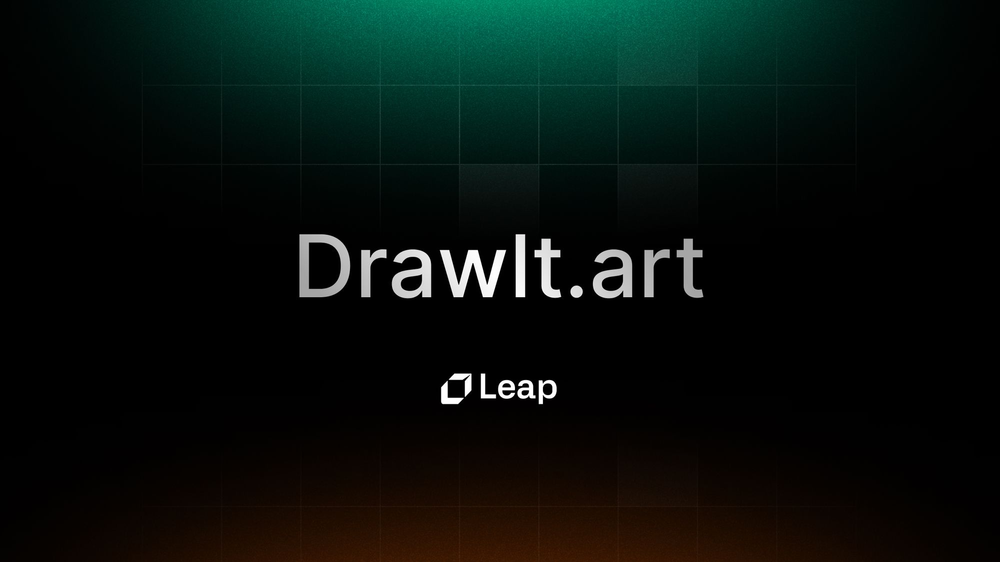

# Build 'DrawIt' a Sketch to Image App using AI (Next.js, Chakra UI, Leap API)



We recently launched 'DrawIt' and app that lets you draw a simple sketch, and then use AI to generate an image based on what you drew.

In this guide we will walk you step by step on how you can rebuild this app using Next.js, Leap, and Chakra UI.


Additionally here are the links to the repo and demo:

- Github Repo: [https://github.com/leap-ai/draw-it](https://github.com/leap-ai/draw-it?ref=leap.mymidnight.blog)
- Demo App: [https://drawit.art/](https://drawit.art/?ref=leap.mymidnight.blog)
- Leap Remix Endpoint API Reference: [https://docs.tryleap.ai/reference/controlcontroller_create](https://docs.tryleap.ai/reference/controlcontroller_create?ref=leap.mymidnight.blog)

## Getting Started

To get stared, create a new next app.

_For npm:_

```bash copy
npx create-next-app@latest
```

_For yarn:_

```bash copy
yarn create next-app
```

You will then be asked a couple of questions, here are the settings we used:

- What is your project named?  `draw-it`
- Would you like to add TypeScript with this project?  `Y`
- Would you like to use ESLint with this project?  `Y`
- Would you like to use Tailwind CSS with this project? `N`
- Would you like to use the `src/ directory` with this project? `N`
- What import alias would you like configured? `(default)`

After initializing your Next.js project, you'll need to install a couple of external packages including Leap's SDK, Chakra UI, and Carbon Icons.

_For npm:_

```bash copy
npm install --save axios @chakra-ui/react @chakra-ui/icons @carbon/icons-react
```

_For yarn:_

```bash copy
yarn add axios @chakra-ui/react @chakra-ui/icons @carbon/icons-react
```

> 💡 Note, this guide is written using Next 13's new "app" router. You will need to modify the code if you want to use it with other frameworks or older versions of Next.js.

## Leap API

To enable the AI functionality that transforms a sketch into an image we will use Leap's Remix API, which lets you submit and existing image plus a prompt, and get back a new image.

First, you will need to create an account with Leap, and copy your API Key. If you do not have an account yet, you can sign up for one [here](http://tryleap.ai/?ref=leap.mymidnight.blog).

Then in your project, create a `.env` file in the root of the project, and paste the key as follows:

```js copy
LEAP_API_KEY = rEpl4ce - th1s - w1th - y0ur - k3y;
```

## Chakra UI

Next, we'll set up Chakra UI's provider so that we can get our app up and running. To do this we will need to edit the `layout.tsx` and `page.tsx` files, and create a new file inside the app folder called `providers.tsx`

They should look like this;

### app/layout.tsx

```ts copy
import { Inter } from "next/font/google";
import { Providers } from "./providers";

const inter = Inter({ subsets: ["latin"] });

export const metadata = {
  title: "Draw It | powered by Leap",
  description: "Sketch something and our AI will generate an image.",
};

export default function RootLayout({
  children,
}: {
  children: React.ReactNode;
}) {
  return (
    <html lang="en">
      <body className={inter.className}>
        <Providers>{children}</Providers>
      </body>
    </html>
  );
}
```

### app/page.tsx

```ts copy
"use client";

import React from "react";
import { Box, Container, Heading, Text, VStack } from "@chakra-ui/react";
import Canvas from "./components/Canvas";

export default function Home() {
  const apiUrl = "/api/remix";

  return (
    <Container maxW="container.lg">
      <VStack align="center" py={16} gap={4}>
        <Heading size={"lg"}>Draw It</Heading>
        <Text textAlign={"center"}>
          Draw something and our AI will generate an image based on your sketch.
        </Text>
      </VStack>
    </Container>
  );
}
```

### app/providers.tsx

```ts copy copy
"use client";

import { CacheProvider } from "@chakra-ui/next-js";
import { ChakraProvider } from "@chakra-ui/react";

export function Providers({ children }: { children: React.ReactNode }) {
  return (
    <CacheProvider>
      <ChakraProvider>{children}</ChakraProvider>
    </CacheProvider>
  );
}
```

Now that you have the project set up, and your .env created, we're ready to begin building the app.

## App Structure

This build consists of two major parts:

- **Endpoints:** Two Next.js API routes that call Leap's API, one route handles submitting the request, and another route handles checking the status.
- **Canvas**: A UI component where a user can draw a sketch, select a style, and then click a button to generate an image. When a user clicks on the generate button, we convert the drawing to an PNG file, and then submit it to an API endpoint. The canvas is also responsible for checking the status of the image, and then displaying the results once the request succeeds.

We'll now break down each of these parts, and walk through all the code you'll need to set it up.

## Endpoints

In total, we'll set up two endpoints, one to `submit-remix` which submits the request to Leap, and one to `check-remix-status` which checks the status of the generation requests.

Your front-end will be responsible for submitting the request, getting back the `remixId`, then using this value to call the `check-remix-status` on an interval (e.g. 3 seconds) to check until the request succeeds.

### app/api/submit-remix/route.ts

This endpoint is what you will call after a user draws in the canvas and submits. It accepts a POST request with a `multipart/form-data` body that contains both the image file and a prompt. It retrieves these values and then passes it on to Leap.

```ts copy
import { NextResponse } from "next/server";

export const runtime = "edge";

async function createFormData(image: File, prompt: string) {
  const formData = new FormData();
  formData.append("files", image);
  formData.append("prompt", prompt || "A hand-drawn sketch");
  formData.append("mode", "scribble");
  formData.append("numberOfImages", "4");

  return formData;
}

async function postImageToApi(formData: FormData) {
  const modelId = "1e7737d7-545e-469f-857f-e4b46eaa151d";
  const apiUrl = `https://api.tryleap.ai/api/v1/images/models/${modelId}/remix`;

  const response = await fetch(apiUrl, {
    method: "POST",
    body: formData,
    headers: {
      Authorization: `Bearer ${process.env.LEAP_API_KEY}`,
    },
  });

  if (!response.ok) {
    throw new Error(`API request failed with status ${response.status}`);
  }

  const jsonResponse = await response.json();
  const remixId = jsonResponse.id;

  if (!remixId) {
    throw new Error("Remix ID not found in API response");
  }

  return remixId;
}

export async function POST(request: Request) {
  // Get the incoming image from form data

  const incomingFormData = await request.formData();
  const image = incomingFormData.get("image") as File | null;
  const prompt = incomingFormData.get("prompt") as string | null;

  if (!image) {
    return NextResponse.json(
      { error: "No image found in request" },
      { status: 400 }
    );
  }

  if (!prompt) {
    return NextResponse.json(
      { error: "No prompt found in request" },
      { status: 400 }
    );
  }

  let remixId;
  try {
    const formData = await createFormData(image, prompt);
    remixId = await postImageToApi(formData);
  } catch (error: unknown) {
    if (error instanceof Error) {
      console.error(
        "Error while making request to external API:",
        error.message
      );
      return NextResponse.json({ error: error.message }, { status: 500 });
    }
  }

  return NextResponse.json({ remixId });
}
```

### app/api/check-remix-status/route.ts

After your front-end calls the endpoint above, it will resolve with a remixId. At this stage the request is in progress, but hasn't completed. So we will use this new endpoint to check the status. Your frontend can poll this endpoint to fetch the latest status and pass it back to your front-end.

```ts copy
import { NextResponse } from "next/server";

export const runtime = "edge";

export async function GET(request: Request) {
  const { searchParams } = new URL(request.url);
  const modelId = searchParams.get("modelId");
  const remixId = searchParams.get("remixId");

  const apiUrl = `https://api.tryleap.ai/api/v1/images/models/${modelId}/remix/${remixId}`;

  try {
    const response = await fetch(apiUrl, {
      headers: {
        Authorization: `Bearer ${process.env.LEAP_API_KEY}`,
      },
    });

    if (!response.ok) {
      return NextResponse.json(
        { error: `Request failed with status ${response.status}` },
        { status: response.status }
      );
    }

    const jsonResponse = await response.json();
    return NextResponse.json(jsonResponse);
  } catch (error: unknown) {
    if (error instanceof Error) {
      console.error("Error while checking the remix status:", error.message);
      return NextResponse.json({ error: error.message }, { status: 500 });
    }
  }
}
```

## Canvas

After creating the endpoints we're ready to move onto the front-end.

The Canvas is a complex UI/front-end component that will enable users to draw, and then submit the request to our endpoints. It will also handle the polling logic needed to check the status of a Leap Remix request, and then display the results when done.

There are a couple of files we'll need to set up:

### Components

- app/components/Canvas.tsx
- app/components/ImageResults.tsx
- app/components/PromptSelector.tsx

### Utilities

- lib/canvasHandlers.ts
- lib/canvasUtils.ts

Let's start with the components:

**app/components/Canvas.tsx**

```ts copy
"use client";

import {
  handleMouseDown,
  handleMouseLeave,
  handleMouseMove,
  handleMouseUp,
  handleTouchEnd,
  handleTouchMove,
  handleTouchStart,
} from "@/lib/canvasHandlers";
import { canvasToBlob } from "@/lib/canvasUtils";
import { pollRemixStatus } from "@/lib/pollRemixStatus";
import { submitImage } from "@/lib/submitImage";
import { RemixImage } from "@/types/remix.type";
import React, { useEffect, useRef, useState } from "react";
import ImageResults from "./ImageResults";
import { Box, Button, Flex, Stack, VStack } from "@chakra-ui/react";
import PromptSelector, { prompts } from "./PromptSelector";

interface CanvasProps {
  width: number;
  height: number;
  apiUrl: string;
}

const Canvas: React.FC<CanvasProps> = (props) => {
  const canvasRef = useRef<HTMLCanvasElement>(null);
  const drawing = useRef<boolean>(false);
  const [isLoading, setIsLoading] = useState(false);
  const [isPolling, setIsPolling] = useState(false);
  const [images, setImages] = useState<RemixImage[]>([]);

  const [selectedPrompt, setSelectedPrompt] = useState({
    key: "",
    value: "",
  });

  useEffect(() => {
    if (canvasRef.current) {
      const canvas = canvasRef.current;
      const ctx = canvas.getContext("2d");

      if (ctx) {
        // Fill the canvas with a white background
        ctx.fillStyle = "white";
        ctx.fillRect(0, 0, props.width, props.height);
      }
    }
  }, [props.height, props.width, images]);

  const handleImageSubmission = async () => {
    setIsLoading(true);
    try {
      const blob = await canvasToBlob(canvasRef);
      const remixId = await submitImage(blob, selectedPrompt.value);
      if (!remixId) {
        alert("Something went wrong. Please try again.");
      } else {
        // Start polling for status
        const modelId = "1e7737d7-545e-469f-857f-e4b46eaa151d";
        setIsPolling(true);
        setIsLoading(false);
        pollRemixStatus(modelId, remixId, setImages, setIsPolling);
      }
    } catch (error: unknown) {
      if (error instanceof Error) {
        console.error("Error while submitting the form data:", error.message);
      }
      setIsLoading(false);
    }
  };

  const clearCanvas = () => {
    setImages([]);
  };

  if (images.length > 0) {
    return (
      <VStack spacing={2} w="full" maxW="lg">
        <ImageResults images={images} />
        <Button onClick={clearCanvas} colorScheme="blue" w={"full"}>
          Try Again
        </Button>
      </VStack>
    );
  }

  return (
    <Stack mx={"auto"}>
      <Box bg={"gray.100"} rounded={"md"} p={2}>
        <canvas
          ref={canvasRef}
          width={props.width}
          height={props.height}
          onMouseDown={(e) => handleMouseDown(e, drawing, canvasRef)}
          onMouseMove={(e) => handleMouseMove(e, drawing, canvasRef)}
          onMouseUp={() => handleMouseUp(drawing)}
          onMouseLeave={() => handleMouseLeave(drawing)}
          onTouchStart={(e) => handleTouchStart(e, drawing, canvasRef)}
          onTouchMove={(e) => handleTouchMove(e, drawing, canvasRef)}
          onTouchEnd={() => handleTouchEnd(drawing)}
          style={{
            touchAction: "none",
            maxWidth: "100%",
            cursor: "url('pen-fountain.svg') 4 28, default",
          }}
        ></canvas>
      </Box>
      <form
        onSubmit={(e) => {
          e.preventDefault();
          handleImageSubmission();
        }}
      >
        <Stack>
          <PromptSelector
            selectedPrompt={selectedPrompt}
            setSelectedPrompt={setSelectedPrompt}
          />
          <Flex gap={2}>
            <Button
              type="submit"
              isLoading={isLoading || isPolling}
              w={"full"}
              colorScheme="blue"
              variant={"solid"}
            >
              Submit
            </Button>
            {!isLoading && !isPolling && (
              <Button onClick={clearCanvas}>Clear</Button>
            )}
          </Flex>
        </Stack>
      </form>
    </Stack>
  );
};

export default Canvas;
```

**app/components/ImageResults.tsx**

```ts copy
import { Box, Image, SimpleGrid } from "@chakra-ui/react";
import { RemixImage } from "@/types/remix.type";
import React from "react";

export default function ImageResults({ images }: { images: RemixImage[] }) {
  return (
    <SimpleGrid
      columns={{
        base: 1,
        sm: 2,
      }}
      spacing={2}
      maxW="6xl"
      m="auto"
    >
      {images.map((image, index) => {
        return (
          <Box key={image.id} width="full" borderRadius="md" overflow="hidden">
            <Image src={image.uri} alt={image.uri} objectFit="cover" />
          </Box>
        );
      })}
    </SimpleGrid>
  );
}
```

**app/components/PromptSelector.tsx**

```ts copy
import {
  Menu,
  MenuButton,
  MenuItem,
  MenuList,
  Button,
  Box,
} from "@chakra-ui/react";
import React, { useEffect } from "react";
import { ChevronDown } from "@carbon/icons-react";

export const prompts = {
  "Animal: Portrait": "8k portrait of an animal",
  "Animal: Wildlife":
    "wildlife scene featuring animals in their natural habitat",
  "Architecture: Modern": "rendering of modern architecture",
  "Architecture: Historical": "illustration of ancient architectural marvels",
  "Art Styles: Cubism": "cubist interpretation of a cityscape",
  "Art Styles: Surrealism": "surreal dreamscape with fantastical elements",
  "Art Styles: Street Art": "colorful street art inspired by urban culture",
  "Nature: Landscape": "panorama of a mountain landscape",
  "Nature: Waterscape": "serene waterscape with boats and reflections",
  "Technology: Futuristic": "illustration of futuristic transportation",
  "Technology: Vintage": "depiction of early 20th century inventions",
  // Add more prompts here
};

export default function PromptSelector({
  selectedPrompt,
  setSelectedPrompt,
}: {
  selectedPrompt: { key: string; value: string };
  setSelectedPrompt: (prompt: { key: string; value: string }) => void;
}) {
  const getRandomPrompt = () => {
    const promptsEntries = Object.entries(prompts);
    return promptsEntries[Math.floor(Math.random() * promptsEntries.length)];
  };

  useEffect(() => {
    const randomPrompt = getRandomPrompt();
    setSelectedPrompt({
      key: randomPrompt[0],
      value: randomPrompt[1],
    });
  }, [setSelectedPrompt]);

  return (
    <Menu>
      <MenuButton
        as={Button}
        colorScheme="blue"
        rightIcon={<ChevronDown />}
        variant={"outline"}
      >
        {selectedPrompt.key || "Select Style"}
      </MenuButton>
      <MenuList>
        {Object.entries(prompts).map(([key, value]) => (
          <MenuItem key={key} onClick={() => setSelectedPrompt({ key, value })}>
            {key}
          </MenuItem>
        ))}
      </MenuList>
    </Menu>
  );
}
```

**lib/canvasHandlers.ts**

```ts copy
import { MouseEvent, TouchEvent } from "react";
import { RefObject } from "react";

import { getMousePos, getTouchPos } from "@/lib/canvasUtils";

interface MutableRefObject<T> {
  current: T;
}

export const handleMouseMove = (
  e: MouseEvent,
  drawing: RefObject<boolean>,
  canvasRef: RefObject<HTMLCanvasElement>
) => {
  if (!drawing.current || !canvasRef.current) return;

  const canvas = canvasRef.current;
  const ctx = canvas.getContext("2d");
  const mousePos = getMousePos(e, canvas);

  if (ctx) {
    ctx.lineTo(mousePos.x, mousePos.y);
    ctx.stroke();
  }
};

export const handleMouseDown = (
  e: MouseEvent,
  drawing: MutableRefObject<boolean>,
  canvasRef: RefObject<HTMLCanvasElement>
) => {
  if (!canvasRef.current) return;

  const canvas = canvasRef.current;
  const ctx = canvas.getContext("2d");
  const mousePos = getMousePos(e, canvas);

  if (ctx) {
    ctx.beginPath();
    ctx.moveTo(mousePos.x, mousePos.y);
    drawing.current = true;
  }
};

export const handleMouseUp = (drawing: MutableRefObject<boolean>) => {
  if (drawing.current) {
    drawing.current = false;
  }
};

export const handleMouseLeave = (drawing: MutableRefObject<boolean>) => {
  if (drawing.current) {
    drawing.current = false;
  }
};

export const handleTouchStart = (
  e: TouchEvent,
  drawing: MutableRefObject<boolean>,
  canvasRef: RefObject<HTMLCanvasElement>
) => {
  if (!canvasRef.current) return;

  const canvas = canvasRef.current;
  const ctx = canvas.getContext("2d");
  const touchPos = getTouchPos(e, canvas);

  if (ctx) {
    ctx.beginPath();
    ctx.moveTo(touchPos.x, touchPos.y);
    drawing.current = true;
  }

  e.preventDefault();
};

export const handleTouchMove = (
  e: TouchEvent,
  drawing: RefObject<boolean>,
  canvasRef: RefObject<HTMLCanvasElement>
) => {
  if (!drawing.current || !canvasRef.current) return;

  const canvas = canvasRef.current;
  const ctx = canvas.getContext("2d");
  const touchPos = getTouchPos(e, canvas);

  if (ctx) {
    ctx.lineTo(touchPos.x, touchPos.y);
    ctx.stroke();
  }

  e.preventDefault();
};

export const handleTouchEnd = (drawing: MutableRefObject<boolean>) => {
  if (drawing.current) {
    drawing.current = false;
  }
};
```

**lib/canvasUtils.ts**

```ts copy
import { MouseEvent, TouchEvent } from "react";
import { RefObject } from "react";

export const getMousePos = (e: MouseEvent, canvas: HTMLCanvasElement) => {
  const rect = canvas.getBoundingClientRect();
  const scaleX = canvas.width / rect.width;
  const scaleY = canvas.height / rect.height;

  return {
    x: (e.clientX - rect.left) * scaleX,
    y: (e.clientY - rect.top) * scaleY,
  };
};

export const getTouchPos = (e: TouchEvent, canvas: HTMLCanvasElement) => {
  const rect = canvas.getBoundingClientRect();
  const scaleX = canvas.width / rect.width;
  const scaleY = canvas.height / rect.height;

  return {
    x: (e.touches[0].clientX - rect.left) * scaleX,
    y: (e.touches[0].clientY - rect.top) * scaleY,
  };
};

export const canvasToBlob = (
  canvasRef: RefObject<HTMLCanvasElement>
): Promise<Blob> => {
  return new Promise((resolve, reject) => {
    if (canvasRef.current) {
      canvasRef.current.toBlob((blob) => {
        if (blob) {
          resolve(blob);
        } else {
          reject(new Error("Canvas toBlob() failed."));
        }
      }, "image/png");
    } else {
      reject(new Error("Canvas ref is null."));
    }
  });
};
```

## Wrapping Up

After implementing all these files you're now ready to run the app. Simply head over to your terminal and type:

_For npm:_

```bash copy
npm run dev
```

_For yarn:_

```bash copy
yarn dev
```

After this, the application will be launched on `http://localhost:3000` if it is available.
