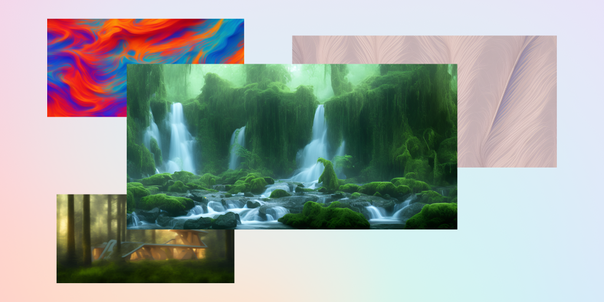
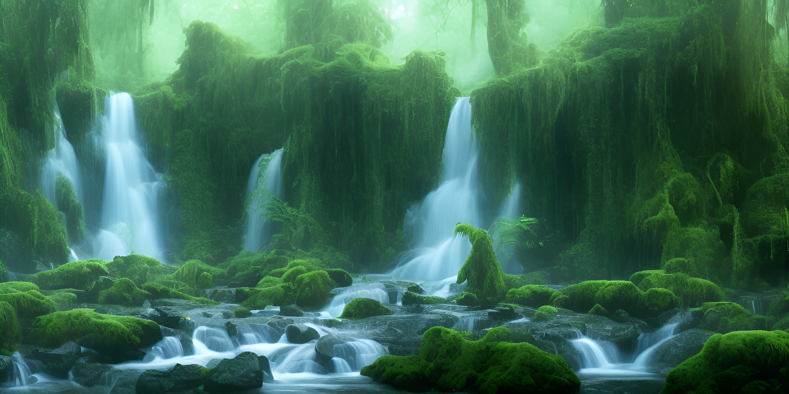

# Generating Backgrounds

One of the most common use-cases for Image Generation is generating backgrounds.

Whether you're building a blog, an email editor, or any other app that may include image headers, backgrounds, or other decorative images – AI generated backgrounds can give you instant access to an infinite amount of creative content.

In this guide, we will highlight some example of prompts you can use, and the code you'll need to generate stunning backgrounds.

You can follow along this guide using the Leap image playground. For best results when generating wallpapers you can set a height of `512` and a width of `800` or greater.  
  
You can also set upscaling to `2x` or `4x` to upscale the result to higher resolutions (such as 4k).  
  
Selecting which model to use within Leap is simple, but for the purpose of this guide, we'll be using `OpenJourney v4`.

## Gradients

Generating gradients is as simple as the following prompt:  
`simple gradient`

But you can also get more creative and add more detail to get more complex results, for example `wallpaper of liquid gradient, fluid, colorful` will get you the following kind of results:

## PixelArt

You can generate interesting pixel art such as the image below by using prompts like `wallpaper of pixel art robot face, pattern, video game`.

## Nature

Natural landscapes can also make for great desktop wallpapers, or decorative headers. Generating the following rainforest waterfall can be achieved with this prompt: `wallpaper of waterfall rainforest, 8k, ultra realistic`

## Architecture

Backgrounds aren't limited to just abstract backgrounds, you can also request additional objects such as architecture by simply briefly describing what you're looking for.  
  
You can use the following prompt to generate modern architecture within a forest `wallpaper of futuristic home in the forest`

Generating backgrounds that are aesthetically pleasing is simple, and can unlock a completely new dimension of creative assets that can take your app to the next level.