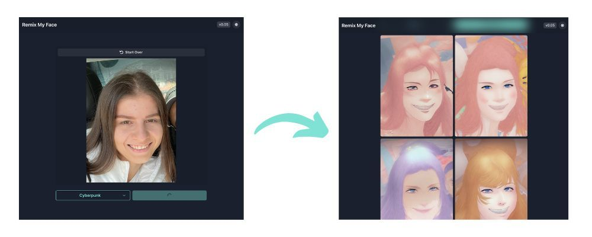

# Build 'Remix My Face' a Selfie to Image app using AI (Next.js, Chakra UI, Leap API)


We recently launched 'Remix My Face' and app that lets you upload a selfie and then transform it to a custom avatar.

In this guide we will walk you step by step on how you can rebuild this app using Next.js, Leap, and Chakra UI.



Additionally here are the links to the repo and demo:

- Github Repo: [https://github.com/leap-ai/remix-my-face](https://github.com/leap-ai/remix-my-face?ref=leap.mymidnight.blog)
- Demo App: [https://www.remixmyface.com/](https://www.remixmyface.com/?ref=leap.mymidnight.blog)
- Leap Remix Endpoint API Reference: [https://docs.tryleap.ai/reference/controlcontroller_create](https://docs.tryleap.ai/reference/controlcontroller_create?ref=leap.mymidnight.blog)

## Getting Started

To get stared, create a new next app.

_For npm:_

```bash copy
npx create-next-app@latest
```

_For yarn:_

```bash copy
yarn create next-app
```

You will then be asked a couple of questions, here are the settings we used:

- What is your project named?  `remix-my-face`
- Would you like to add TypeScript with this project?  `Y`
- Would you like to use ESLint with this project?  `Y`
- Would you like to use Tailwind CSS with this project? `N`
- Would you like to use the `src/ directory` with this project? `N`
- What import alias would you like configured? `(default)`

After initializing your Next.js project, you'll need to install a couple of external packages including Leap's SDK, Chakra UI, and Carbon Icons.

_For npm:_

```bash copy
npm install --save axios @chakra-ui/react @chakra-ui/icons @carbon/icons-react
```

_For yarn:_

```bash copy
yarn add axios @chakra-ui/react @chakra-ui/icons @carbon/icons-react
```

> 💡 Note, this guide is written using Next 13's new "app" router. You will need to modify the code if you want to use it with other frameworks or older versions of Next.js.

## Leap API

To enable the AI functionality that transforms a sketch into an image we will use Leap's Remix API, which lets you submit and existing image plus a prompt, and get back a new image.

First, you will need to create an account with Leap, and copy your API Key. If you do not have an account yet, you can sign up for one [here](http://tryleap.ai/?ref=leap.mymidnight.blog).

Then in your project, create a `.env` file in the root of the project, and paste the key as follows - replacing `your_api_key` with your actual key:

```js copy
LEAP_API_KEY = your_api_key;
```

## Chakra UI

Next, we'll set up Chakra UI's provider so that we can get our app up and running. To do this we will need to edit the `layout.tsx` and `page.tsx` files, and create a new file inside the app folder called `providers.tsx`

They should look like this;

### app/layout.tsx

```ts copy
import { Inter } from "next/font/google";
import GoogleAnalytics from "./components/GoogleAnalytics";
import { Providers } from "./providers";

const inter = Inter({ subsets: ["latin"] });

export const metadata = {
  title: "Remix My Face | powered by Leap",
  description: "Take a selfie, get a custom avatar.",
};

export default function RootLayout({
  children,
}: {
  children: React.ReactNode;
}) {
  return (
    <html
      lang="en"
      style={{
        minHeight: "100vh",
      }}
    >
      <body
        className={inter.className}
        style={{
          height: "100%",
        }}
      >
        <Providers>{children}</Providers>
      </body>
      <GoogleAnalytics />
    </html>
  );
}
```

### app/page.tsx

```ts copy
"use client";

import { pollRemixStatus } from "@/lib/pollRemixStatus";
import { resizeFile } from "@/lib/resizer";
import { submitImage } from "@/lib/submitImage";
import { RemixImage } from "@/types/remix.type";
import { FaMagic } from "react-icons/fa";

import {
  Button,
  Container,
  HStack,
  Heading,
  Icon,
  Image,
  Stack,
  Text,
  VStack,
} from "@chakra-ui/react";
import { useEffect, useState } from "react";
import Footer from "./components/Footer";
import ImageResultsList from "./components/ImageResultsList";
import ImageSelector from "./components/ImageSelector";
import Navbar from "./components/Navbar";
import PromptSelector from "./components/PromptSelector";

export default function Home() {
  const [image, setImage] = useState<File | null>(null);
  const [loading, setLoading] = useState(false);
  const [polling, setPolling] = useState(false);
  const [results, setResults] = useState<RemixImage[]>([]);
  const [prompt, setPrompt] = useState({
    key: "",
    value: "",
  });

  useEffect(() => {
    if (!image) {
      setResults([]);
    }
  }, [image]);

  const handleSubmit = async () => {
    setLoading(true);
    setResults([]);
    console.log("SUBMIT", { image });
    if (image) {
      // Submit
      const resizedImage = await resizeFile(image);
      // Check if resizedImage is a Blob
      if (!(resizedImage instanceof Blob)) {
        console.log(typeof resizedImage);
        console.error("Error resizing image");
        return;
      } else {
        console.log("Image resized", resizedImage);
      }

      const remixId = await submitImage(resizedImage, prompt.value);
      if (!remixId) return;

      // Poll
      await pollRemixStatus(
        // Specify the Model Id you want to use here
        "1e7737d7-545e-469f-857f-e4b46eaa151d",
        remixId,
        setResults,
        setPolling
      );
    }
    setLoading(false);
  };

  return (
    <VStack>
      <Navbar />
      <Container maxWidth="container.sm" h={"full"}>
        <VStack
          align="center"
          py={12}
          gap={4}
          justifyContent={"center"}
          alignItems={"center"}
          h={"full"}
          w={"full"}
        >
          {!image && (
            <>
              <VStack>
                <Stack gap={0}>
                  <Heading textAlign={"center"} lineHeight={1}>
                    Take a selfie,
                  </Heading>
                  <Heading textAlign={"center"} lineHeight={1}>
                    get a custom avatar using AI.
                  </Heading>
                </Stack>
                <Image
                  src={"/example-hq-1.png"}
                  alt="Example"
                  width={"full"}
                  height="auto"
                  objectFit={"contain"}
                  maxH={250}
                  maxW={500}
                />
              </VStack>
            </>
          )}
          <ImageSelector image={image} setImage={setImage} />
          {image && (
            <HStack w={"full"}>
              <PromptSelector
                selectedPrompt={prompt}
                setSelectedPrompt={setPrompt}
              />
              <Button
                onClick={handleSubmit}
                isLoading={loading || polling}
                rightIcon={<Icon as={FaMagic} />}
                w={"full"}
                colorScheme="teal"
              >
                Remix
              </Button>
            </HStack>
          )}
          {(loading || polling) && (
            <Text fontSize={"0.7rem"}>
              Generating can take about 30 seconds. Hang tight!
            </Text>
          )}
          <ImageResultsList images={results} />
        </VStack>
      </Container>
      <Footer />
    </VStack>
  );
}
```

### app/providers.tsx

```ts copy
"use client";

import { CacheProvider } from "@chakra-ui/next-js";
import { ChakraProvider } from "@chakra-ui/react";

export function Providers({ children }: { children: React.ReactNode }) {
  return (
    <CacheProvider>
      <ChakraProvider>{children}</ChakraProvider>
    </CacheProvider>
  );
}
```

Now that you have the project set up, and your .env created, we're ready to begin building the app.

## App Structure

This build consists of two major parts:

- **Endpoints:** Two Next.js API routes that call Leap's API, one route handles submitting the request, and another route handles checking the status.
- **Front-end:** We will create a series of front-end components including an Image Selector which will enable the user to upload an image, and Image Results, which will render the avatars. In addition, we will also create a Prompt Selector to handle the style that we want users to choose from. In the Image Selector, we will also add a client-side image resizer to make sure that user images are reduced in size before they are sent to the API.

We'll now break down each of these parts, and walk through all the code you'll need to set it up.

## Endpoints

In total, we'll set up two endpoints, one to `submit-remix` which submits the request to Leap, and one to `check-remix-status` which checks the status of the generation requests.

Your front-end will be responsible for submitting the request, getting back the `remixId`, then using this value to call the `check-remix-status` on an interval (e.g. 3 seconds) to check until the request succeeds.

### app/api/submit-remix/route.ts

This endpoint is what you will call after a user draws in the canvas and submits. It accepts a POST request with a `multipart/form-data` body that contains both the image file and a prompt. It retrieves these values and then passes it on to Leap.

```ts copy
import { NextResponse } from "next/server";

export const runtime = "edge";

async function createFormData(image: File, prompt: string) {
  const formData = new FormData();
  formData.append("files", image);
  formData.append("prompt", prompt || "A hand-drawn sketch");
  formData.append(
    "negativePrompt",
    "watermark, blurry, low-res, low contrast, desaturated"
  );
  formData.append("mode", "canny");
  formData.append("numberOfImages", "4");

  return formData;
}

async function postImageToApi(formData: FormData) {
  const modelId = "1e7737d7-545e-469f-857f-e4b46eaa151d";
  const apiUrl = `https://api.tryleap.ai/api/v1/images/models/${modelId}/remix`;

  const response = await fetch(apiUrl, {
    method: "POST",
    body: formData,
    headers: {
      Authorization: `Bearer ${process.env.LEAP_API_KEY}`,
    },
  });

  if (!response.ok) {
    throw new Error(`API request failed with status ${response.status}`);
  }

  const jsonResponse = await response.json();
  const remixId = jsonResponse.id;

  if (!remixId) {
    throw new Error("Remix ID not found in API response");
  }

  return remixId;
}

export async function POST(request: Request) {
  // Get the incoming image from form data

  const incomingFormData = await request.formData();
  const image = incomingFormData.get("image") as File | null;
  const prompt = incomingFormData.get("prompt") as string | null;

  if (!image) {
    return NextResponse.json(
      { error: "No image found in request" },
      { status: 400 }
    );
  }

  if (!prompt) {
    return NextResponse.json(
      { error: "No prompt found in request" },
      { status: 400 }
    );
  }

  let remixId;
  try {
    const formData = await createFormData(image, prompt);
    remixId = await postImageToApi(formData);
  } catch (error: unknown) {
    if (error instanceof Error) {
      console.error(
        "Error while making request to external API:",
        error.message
      );
      return NextResponse.json({ error: error.message }, { status: 500 });
    }
  }

  return NextResponse.json({ remixId });
}
```

### app/api/check-remix-status/route.ts

After your front-end calls the endpoint above, it will resolve with a remixId. At this stage the request is in progress, but hasn't completed. So we will use this new endpoint to check the status. Your frontend can poll this endpoint to fetch the latest status and pass it back to your front-end.

```ts copy
import { NextResponse } from "next/server";

export const runtime = "edge";

export async function GET(request: Request) {
  const { searchParams } = new URL(request.url);
  const modelId = searchParams.get("modelId");
  const remixId = searchParams.get("remixId");

  const apiUrl = `https://api.tryleap.ai/api/v1/images/models/${modelId}/remix/${remixId}`;

  try {
    const response = await fetch(apiUrl, {
      headers: {
        Authorization: `Bearer ${process.env.LEAP_API_KEY}`,
      },
    });

    if (!response.ok) {
      return NextResponse.json(
        { error: `Request failed with status ${response.status}` },
        { status: response.status }
      );
    }

    const jsonResponse = await response.json();
    return NextResponse.json(jsonResponse);
  } catch (error: unknown) {
    if (error instanceof Error) {
      console.error("Error while checking the remix status:", error.message);
      return NextResponse.json({ error: error.message }, { status: 500 });
    }
  }
}
```

## FrontEnd

After creating the endpoints we're ready to move onto the front-end.

The frontend here is relatively simple. Our "page" route handles most of the state, and then we have more atomic files for handling the Image Upload, and Image Results, and Prompt Selection.

There are a couple of files we'll need to set up:

### Components

- **app/components/ImageSelector.tsx:** Handles the file upload, and then displays the selected file.
- **app/components/ImageResult.tsx:** A single image result (with a built-in modal for expanding an image)
- **app/components/ImageResultsList.tsx:** Renders an array of Image Results after the remix has succeeded.
- **app/components/PromptSelector.tsx:** Lets a user select the style.

You'll notice the components here are already listed on the page code snippet above.

There are a few more decorative components such as the Navbar and Footer, but these are not essential, so we'll skip those for the purpose of this guide.

### Utilities

- lib/pollRemixStatus.ts
- lib/resizer.ts
- lib/submitImage.ts

Let's start with the components:

**app/components/ImageSelector.tsx**

- Handles the file upload, and then displays the selected file.

```ts
// Import necessary components and icons from Chakra UI and React-icons
import {
  Button,
  FormControl,
  Icon,
  Image,
  Input,
  VStack,
} from "@chakra-ui/react";
import { ChangeEvent, useRef } from "react";
import { FaUndo } from "react-icons/fa";
import { FiUpload } from "react-icons/fi";

interface ImageSelectorProps {
  image: File | null;
  setImage: (image: File | null) => void;
}

// Create a new functional component called ImageSelector
const ImageSelector = ({ image, setImage }: ImageSelectorProps) => {
  // Create a reference to the hidden file input element
  const fileInputRef = useRef<HTMLInputElement>(null);

  // Handle the button click event to trigger the actual file input click
  const handleButtonClick = () => {
    fileInputRef.current?.click();
  };

  // Handle the file input change event and update the image state
  const handleFileChange = ({
    target: { files },
  }: ChangeEvent<HTMLInputElement>) => {
    setImage(files ? files[0] : null);
  };

  // If an image is already selected, show a button to start over and the selected image
  if (image) {
    return (
      <VStack w={"full"} bg={"blackAlpha.100"} rounded="md" p={2}>
        <Button
          onClick={() => setImage(null)}
          leftIcon={<Icon as={FaUndo} />}
          size={"sm"}
          w={"full"}
        >
          Start Over
        </Button>
        <Image
          src={URL.createObjectURL(image)}
          alt="Selected Image"
          objectFit={"contain"}
          maxH={500}
          maxW={500}
          w={"full"}
          rounded={"md"}
        />
      </VStack>
    );
  }

  // If no image is selected, show a button to upload or take a selfie
  return (
    <FormControl id="file-upload" mt={6}>
      <Input
        type="file"
        onChange={handleFileChange}
        display="none"
        ref={fileInputRef}
      />
      <Button
        leftIcon={<Icon as={FiUpload} />}
        colorScheme="teal"
        variant="solid"
        onClick={handleButtonClick}
        w={"full"}
      >
        Upload or Take Selfie
      </Button>
    </FormControl>
  );
};

export default ImageSelector;
```

**app/components/ImageResult.tsx**

- Displays a single image result.
- On Click it also opens up a modal so a user can enlarge their result.

```ts copy
// Import necessary Chakra UI components and hooks
import {
  Box,
  Button,
  HStack,
  IconButton,
  Image,
  Link,
  Modal,
  ModalBody,
  ModalCloseButton,
  ModalContent,
  ModalHeader,
  ModalOverlay,
  Text,
  VStack,
} from "@chakra-ui/react";
import { useState } from "react";
// Import social media icons
import { FaFacebook, FaLinkedin, FaPinterest, FaTwitter } from "react-icons/fa";

interface ImageResultProps {
  src: string;
}

// ImageResult component expects a single prop: "src"
export default function ImageResult({ src }: ImageResultProps) {
  // State for modal visibility
  const [isOpen, setIsOpen] = useState(false);

  // Functions to open and close the modal
  const onOpen = () => setIsOpen(true);
  const onClose = () => setIsOpen(false);

  // Message and encodedMessage used to share on social media platforms
  const message =
    "Check out this cool website by @leap_api where you can upload a selfie and create custom avatars https://remixmyface.com";
  const encodedMessage = encodeURIComponent(message);
  const downloadFileName = "custom_avatar.png";

  // URLs for sharing to different social media platforms
  const twitterShareUrl = `https://twitter.com/intent/tweet?text=${encodedMessage}`;
  const facebookShareUrl = `https://www.facebook.com/sharer/sharer.php?quote=${encodedMessage}`;
  const linkedinShareUrl = `https://www.linkedin.com/shareArticle?mini=true&url=https://tryleap.ai&title=${encodedMessage}`;
  const pinterestShareUrl = `https://pinterest.com/pin/create/button/?url=https://tryleap.ai&media=${src}&description=${encodedMessage}`;

  return (
    <>
      {/* Trigger for opening modal */}
      <Box
        onClick={onOpen}
        _hover={{
          opacity: 0.8,
          transition: "all 0.2s ease-in-out",
        }}
      >
        {/* Image thumbnail */}
        <Image
          src={src}
          alt={src}
          objectFit="cover"
          cursor={"pointer"}
          rounded={"md"}
        />
      </Box>

      {/* Modal for showing image, download, and share options */}
      <Modal isOpen={isOpen} onClose={onClose} size="xl">
        <ModalOverlay />
        <ModalContent>
          <ModalHeader>Download & Share on Social Media</ModalHeader>
          <ModalCloseButton />
          <ModalBody>
            <VStack gap={4} py={4}>
              {/* Full-size image */}
              <Image src={src} alt={src} objectFit="contain" />
              {/* Share prompt */}
              <Text>Share this website with your friends!</Text>
              {/* Container for buttons */}
              <HStack>
                {/* Download button */}
                <Button as="a" href={src} download={downloadFileName}>
                  Download
                </Button>
                {/* Social media buttons */}
                <IconButton
                  as={Link}
                  href={twitterShareUrl}
                  target="_blank"
                  aria-label="Share on Twitter"
                  icon={<FaTwitter />}
                />
                <IconButton
                  as={Link}
                  href={facebookShareUrl}
                  target="_blank"
                  aria-label="Share on Facebook"
                  icon={<FaFacebook />}
                />
                <IconButton
                  as={Link}
                  href={linkedinShareUrl}
                  target="_blank"
                  aria-label="Share on LinkedIn"
                  icon={<FaLinkedin />}
                />
                <IconButton
                  as={Link}
                  href={pinterestShareUrl}
                  target="_blank"
                  aria-label="Share on Pinterest"
                  icon={<FaPinterest />}
                />
              </HStack>
            </VStack>
          </ModalBody>
        </ModalContent>
      </Modal>
    </>
  );
}
```

**app/components/ImageResultsList.tsx**

- Renders all of the Image Results after the remix has succeeded.

```ts copy
// Import necessary components and types
import { RemixImage } from "@/types/remix.type";
import { Box, SimpleGrid } from "@chakra-ui/react";
import ImageResult from "./ImageResult";

// Define the ImageResultsList component, which takes a list of images to display
export default function ImageResultsList({ images }: { images: RemixImage[] }) {
  // Render the component using a Chakra UI SimpleGrid for a responsive layout
  return (
    <SimpleGrid
      columns={{
        base: 1, // The grid will show 1 column on small screens
        sm: 2, // The grid will show 2 columns on larger screens
      }}
      spacing={2} // Space between grid items is 2 units
      maxW="6xl" // Maximum width of the grid is 6xl
      m="auto" // Center the grid using auto margins
    >
      {/* For each image in the images array, render an ImageResult component */}
      {images.map((image, index) => {
        return (
          // Use a Chakra UI Box component for containing the image
          <Box key={image.id} width="full" borderRadius="md" overflow="hidden">
            {/* Render the ImageResult component with the current image's URI */}
            <ImageResult src={image.uri} />
          </Box>
        );
      })}
    </SimpleGrid>
  );
}
```

**app/components/PromptSelector.tsx**

- Lets a user select the style by providing a series of pre-set prompts.

```ts copy
import { ChevronDown } from "@carbon/icons-react";
import { Button, Menu, MenuButton, MenuItem, MenuList } from "@chakra-ui/react";
import { useEffect } from "react";

export const prompts = {
  Cyberpunk: "8k portrait in cyberpunk art style",
  "Neon Noir": "8k portrait in neon noir art style",
  "Starry Night":
    "8k portrait in Vincent van Gogh's Starry Night-inspired style",
  "Paper Cut-Out": "8k portrait in paper cut-out art style",
  "Glitch Art": "8k portrait in glitch art style",
  "Low Poly": "8k portrait in low poly art style",
  "Lego Style": "8k portrait in Lego-inspired art style",
  "Juxtaposed Collage": "8k portrait in juxtaposed collage art style",
  Silhouette: "8k portrait in silhouette art style",
  Origami: "8k portrait in origami-inspired art style",
  Watercolor: "8k portrait in watercolor art style",
  "Floral Pattern": "8k portrait in floral pattern art style",
  Anime: "8k portrait in anime art style",
  "Fairy Tale": "8k portrait in fairy tale-inspired art style",
  Kawaii: "8k portrait in kawaii art style",
  Disney: "8k portrait in modern disney style",
  "Marvel Comic": "8k portrait in marvel comic art style",
};

// PromptSelector component allows users to choose an art style
export default function PromptSelector({
  selectedPrompt,
  setSelectedPrompt,
}: {
  selectedPrompt: { key: string; value: string };
  setSelectedPrompt: (prompt: { key: string; value: string }) => void;
}) {
  // Function to get a random art style from prompts
  const getRandomPrompt = () => {
    const promptsEntries = Object.entries(prompts);
    return promptsEntries[Math.floor(Math.random() * promptsEntries.length)];
  };

  // Set an initial random art style when the component is first rendered
  useEffect(() => {
    const randomPrompt = getRandomPrompt();
    setSelectedPrompt({
      key: randomPrompt[0],
      value: randomPrompt[1],
    });
  }, [setSelectedPrompt]);

  return (
    // Chakra UI Menu component - creates a dropdown menu
    <Menu>
      {/* MenuButton displays the selected art style, clicking it opens the menu */}
      <MenuButton
        as={Button}
        colorScheme="teal"
        rightIcon={<ChevronDown />}
        variant={"outline"}
        w={"full"}
      >
        {selectedPrompt.key || "Select Style"}
      </MenuButton>

      {/* MenuList contains MenuItem(s) with available art styles */}
      <MenuList>
        {/* Map over prompts and generate MenuItem(s) for each art style */}
        {Object.entries(prompts).map(([key, value]) => (
          <MenuItem
            key={key}
            // Clicking a MenuItem sets the selectedPrompt to the chosen art style
            onClick={() => setSelectedPrompt({ key, value })}
          >
            {key}
          </MenuItem>
        ))}
      </MenuList>
    </Menu>
  );
}
```

And finally, we'll implement our utilities;

**lib/pollRemixStatus.ts**

```ts copy
import axios from "axios";
import { RemixImage, RemixResponse } from "@/types/remix.type";

// Properties required for polling remix status
interface PollRemixStatusProps {
  modelId: string;
  remixId: string;
  updateStatus: (images: RemixImage[]) => void;
  setIsPolling: (isPolling: boolean) => void;
}

// Define the polling interval in milliseconds
const POLL_INTERVAL_MS = 3000;

// The checkStatus function polls the remix status, updates images and recursively calls itself
// until the status is either "finished" or "failed"
async function checkStatus(
  { modelId, remixId, updateStatus, setIsPolling }: PollRemixStatusProps,
  pollInterval: number
): Promise<void> {
  try {
    // Send an API request to the server
    const response = await axios.get<RemixResponse>(
      `/api/check-remix-status?modelId=${modelId}&remixId=${remixId}`
    );

    // Extract the remix status
    const status = response.data.status;

    // If the status is "finished" or "failed", update images and stop polling
    if (status === "finished" || status === "failed") {
      updateStatus(response.data.images);
      setIsPolling(false);
    }
    // Keep polling if the status is "queued" or "processing"
    else if (status === "queued" || status === "processing") {
      setTimeout(
        () =>
          checkStatus(
            { modelId, remixId, updateStatus, setIsPolling },
            pollInterval
          ),
        pollInterval
      );
    }
    // Throw an error if the received status is unexpected
    else {
      throw new Error("Unexpected status value");
    }
  } catch (error: unknown) {
    if (error instanceof Error) {
      console.error("Error while polling for remix status:", error.message);
    }
  }
}

// The pollRemixStatus function starts the polling process by setting the isPolling state to true
// and calling the checkStatus function for the first time
export const pollRemixStatus = (
  modelId: string,
  remixId: string,
  updateStatus: (images: RemixImage[]) => void,
  setIsPolling: (isPolling: boolean) => void
): Promise<void> => {
  setIsPolling(true);

  return checkStatus(
    { modelId, remixId, updateStatus, setIsPolling },
    POLL_INTERVAL_MS
  );
};
```

**lib/resizer.ts**

```ts copy
import Resizer from "react-image-file-resizer";

// Function to resize an image file that accepts a file as input
export const resizeFile = (file: File) => {
  // Create a new Promise to handle the resized image
  return new Promise<string | File | Blob | ProgressEvent<FileReader>>(
    (resolve) => {
      // Calls the imageFileResizer function from the 'react-image-file-resizer' library
      Resizer.imageFileResizer(
        file, // File - the input image file to be resized
        1000, // maxWidth - the maximum width of the resized image
        1000, // maxHeight - the maximum height of the resized image
        "JPEG", // Output format - use 'JPEG' for JPEG images
        100, // Quality - image quality (0 - 100) where 100 is the highest
        0, // Rotation - sets the rotation of the resized image (0 - no rotation)
        (blob) => {
          resolve(blob); // Callback function called once the image is resized, resolves the Promise with the resized image
        },
        "blob" // Output type - indicates the format of the resized image to be returned ('file', 'base64', or 'blob')
      );
    }
  );
};
```

**lib/submitImage.ts**

```ts copy
// Import the necessary library for sending HTTP requests
import axios from "axios";

// Create an interface to define the expected response structure for the submitImage API call
interface SubmitImageResponse {
  remixId: string;
}

// This function submits an image file (Blob) and an associated prompt to the /api/submit-remix endpoint
// If successful, it returns the unique remixId for the submitted image
// In case of an error, it returns null
export async function submitImage(
  blob: Blob,
  prompt: string
): Promise<string | null> {
  try {
    // Create a FormData instance to hold the image file and prompt
    const formData = new FormData();
    formData.append("image", blob); // Add the image Blob to the form data
    formData.append("prompt", prompt); // Add the prompt to the form data

    // Configure and send a POST request to the /api/submit-remix endpoint with the FormData object
    // The 'Content-Type' header is set to 'multipart/form-data' for submitting the form data
    const response = await axios.post<SubmitImageResponse>(
      "/api/submit-remix",
      formData,
      {
        headers: { "Content-Type": "multipart/form-data" },
      }
    );

    // Return the unique remixId for the submitted image if the request is successful
    return response.data.remixId;
  } catch (error: unknown) {
    // Handle errors that occur during the submission process without logging
    // This improves user experience, as console logs are removed in the cleaned-up code
    if (error instanceof Error) {
      return null;
    }
    return null;
  }
}
```

## Wrapping Up

After implementing all these files you're now ready to run the app. Simply head over to your terminal and type:

_For npm:_

```bash copy
npm run dev
```

_For yarn:_

```bash copy
yarn dev
```

After this, the application will be launched on `http://localhost:3000` if it is available.
