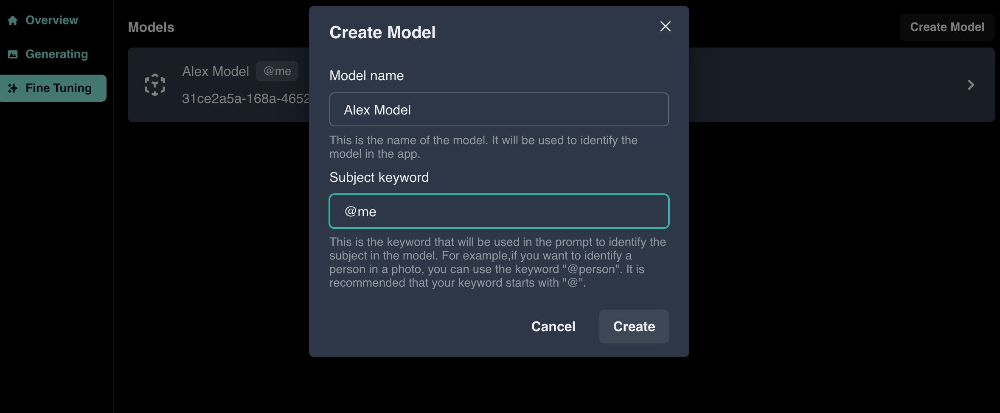
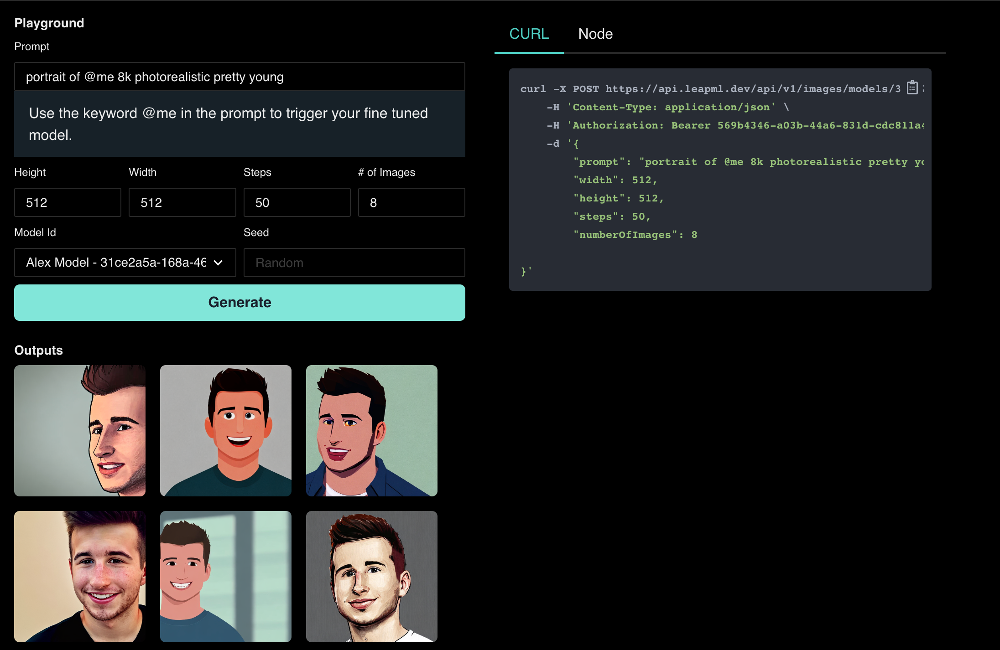
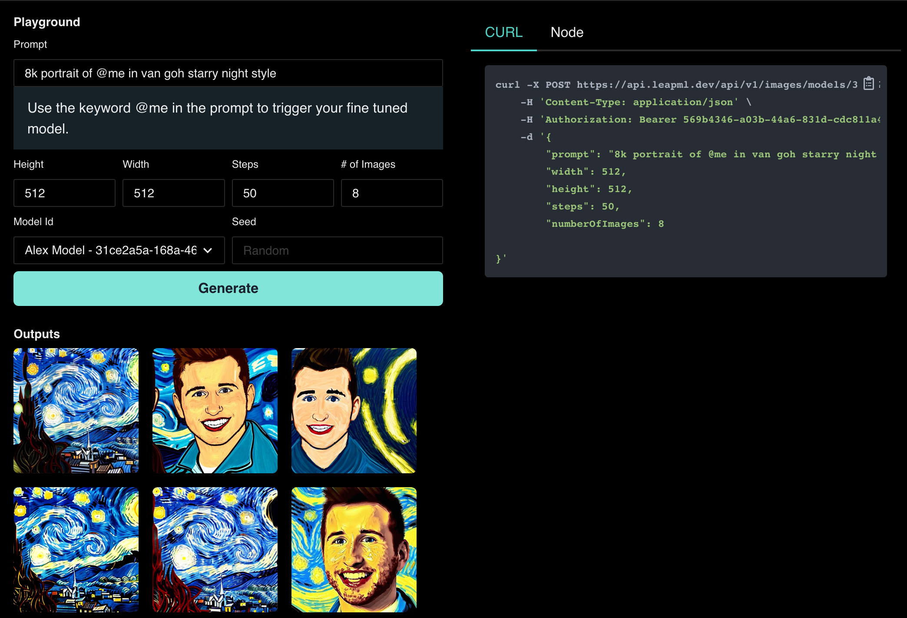

# Train Your Own Custom Models Using Leap Dashboard

## 📝 Getting Started

In this guide we will be training our own custom fine-tuned model to use to generate images using the Leap dashboard.

You can use fine-tuned image models to generate AI avatars, assets, and more!

By the end of this guide, you should have a custom model you can use to generate AI avatars like this:

A quick overview of what you'll need to get started:

1. An account on [https://www.leapml.dev/signup](https://www.leapml.dev/signup)
2. Image samples to train your model on

And an overview of the steps we'll cover in this guide:

1. Creating A Model
2. Uploading Image Samples
3. Queueing A Training Job
4. Generating Images w/ Your Model

## 1️⃣ Creating A Model

To begin, we'll create a model that is trained on Alex, a team member at Leap. To do this, we'll use the LeapML dashboard.

To create a model using the dashboard:

1. First, navigate to Fine Tuning and click "Create Model"

2. Next, add a title for the model (e.g. "Alex Model") and a subject keyword (e.g. "@me" which will refer to Alex) and click "Create"

## 2️⃣ Uploading Image Samples

Now add your image samples. You can train on people, objects, or styles. For our example we'll be training on Alex.

For best results, resize your image samples so that each sample is 512x512 (you can a website like [https://www.birme.net/](https://www.birme.net/) to do so).

Also we recommend using 3+ images and making sure your subject is clearly in view. Next, click "Upload".

## 3️⃣ Queueing A Training Job

Finally, once your image samples are uploaded, click "Train New Version" to queue training.

You should get an email when your model is done training and ready to generate images!

## 4️⃣ Generating Images w/ Your Model

Once your model is done training you should see the status update to "Finished".

Next to start generating images with your custom model, click "Try In Playground".

Now, in the playground you'll be able to generate images by clicking "Generate".

Add the "@me" identifier to your prompt and try out a few example prompts to get great looking AI Avatars!

- Portrait Style 👉 "portrait of @me 8k photorealistic pretty young"
- Van Gogh Style 👉 "8k portrait of @me in van gogh starry night style"

Find more prompts here 👇

[Stellar Prompts for AI Avatars](/guides/stellar-prompts-for-ai-avatars)

## 🔑 Additional Config

We recommend experimenting with different prompts and steps for best results.

More steps will usually result in better images but take longer to generate.

## 🚀 Wrapping Up

That's all for this guide!

Try it out for yourself and let us know if you have any questions. For additional support please join our [discord](https://discord.com/invite/NCAKTUayPK).